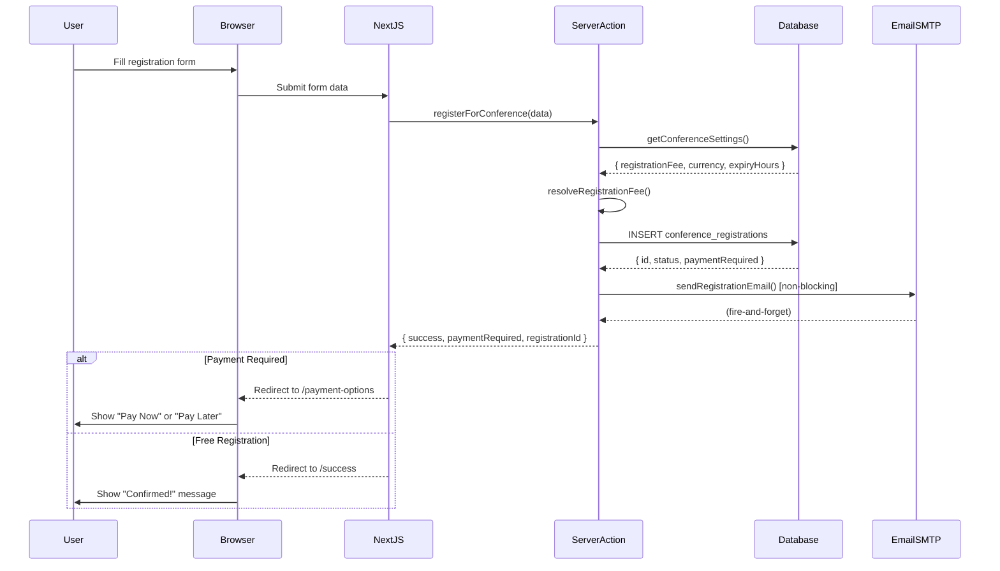
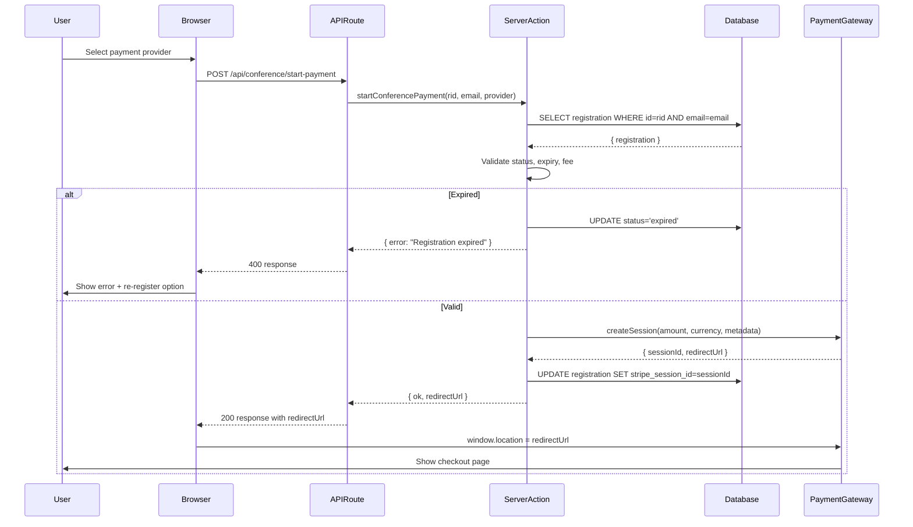
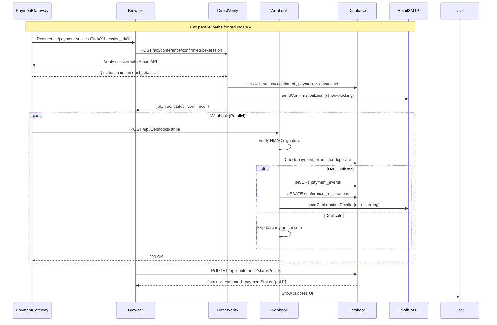
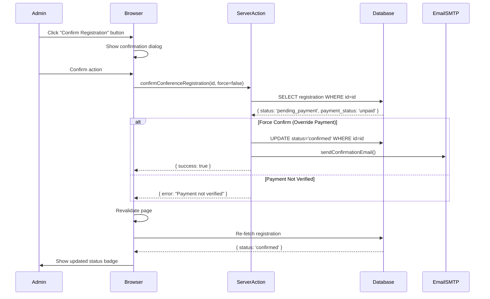
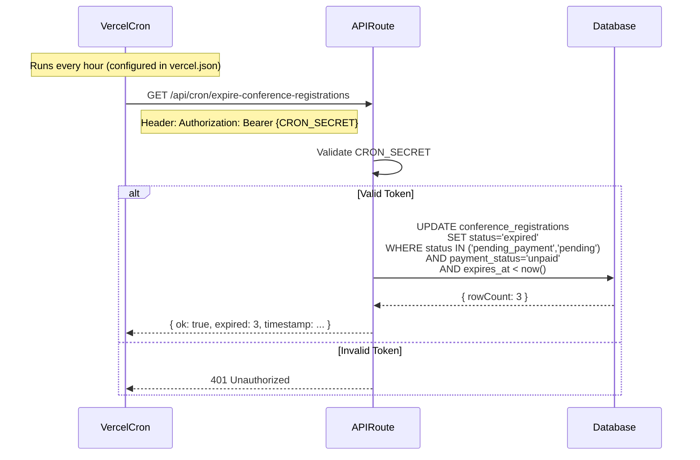

# DEESSA Foundation — Conference Module: Architecture & System Responsibilities

> **Version:** 1.0.0  
> **Last Updated:** February 28, 2026  
> **Audience:** Technical Architects, System Designers, DevOps Engineers

---

## Table of Contents

1. [System Architecture Overview](#1-system-architecture-overview)
2. [Component Topology](#2-component-topology)
3. [Responsibility & Ownership Model](#3-responsibility--ownership-model)
4. [Data Flow Architecture](#4-data-flow-architecture)
5. [Integration Points](#5-integration-points)
6. [Scalability Architecture](#6-scalability-architecture)
7. [Failure Modes & Resilience](#7-failure-modes--resilience)

---

## 1. System Architecture Overview

### 1.1 Architecture Pattern

**Pattern**: Monolithic Next.js Application with API Routes

```
┌────────────────────────────────────────────────────────────────┐
│                        VERCEL EDGE NETWORK                     │
│                    (Global CDN + Edge Functions)               │
└────────────────────────────┬───────────────────────────────────┘
                             │
                ┌────────────▼─────────────┐
                │  NEXT.JS 14 APPLICATION  │
                │  (App Router + API)      │
                │                          │
                │  ┌────────────────────┐  │
                │  │ Public Pages       │  │
                │  │ • Landing          │  │
                │  │ • Registration     │  │
                │  │ • Payment Flow     │  │
                │  └────────────────────┘  │
                │                          │
                │  ┌────────────────────┐  │
                │  │ Admin Pages        │  │
                │  │ • Dashboard        │  │
                │  │ • Detail View      │  │
                │  │ • Settings         │  │
                │  └────────────────────┘  │
                │                          │
                │  ┌────────────────────┐  │
                │  │ API Routes         │  │
                │  │ • Payment Init     │  │
                │  │ • Webhooks         │  │
                │  │ • Status Polling   │  │
                │  │ • Cron Jobs        │  │
                │  └────────────────────┘  │
                │                          │
                │  ┌────────────────────┐  │
                │  │ Server Actions     │  │
                │  │ • Registration     │  │
                │  │ • Admin Actions    │  │
                │  │ • Settings Mgmt    │  │
                │  └────────────────────┘  │
                └──────────┬───────────────┘
                           │
            ┌──────────────┼──────────────┐
            │              │              │
            ▼              ▼              ▼
    ┌──────────────┐  ┌────────┐  ┌──────────────┐
    │  SUPABASE    │  │ GMAIL  │  │   PAYMENT    │
    │  PostgreSQL  │  │ SMTP   │  │   GATEWAYS   │
    │  + Auth      │  │        │  │              │
    │  + Storage   │  │  587   │  │ • Stripe     │
    │              │  │        │  │ • Khalti     │
    │  RLS + Pools │  └────────┘  │ • eSewa      │
    └──────────────┘              └──────────────┘
```

### 1.2 Architectural Principles

| Principle                   | Implementation                                                 | Rationale                              |
| --------------------------- | -------------------------------------------------------------- | -------------------------------------- |
| **Separation of Concerns**  | Clear boundaries between public, admin, API, and action layers | Maintainability, security, testability |
| **Progressive Enhancement** | Server-side rendering where possible                           | SEO, performance, accessibility        |
| **Fail-Safe Defaults**      | Email failures don't crash registration                        | Reliability over completeness          |
| **Defense in Depth**        | Multiple security layers (RLS, dual-key, HMAC)                 | Security resilience                    |
| **Idempotency**             | Webhook and direct-verify can both run safely                  | Production reliability                 |
| **Explicit State Machines** | Documented status transitions                                  | Predictable behavior                   |
| **Configuration Over Code** | Settings stored in DB, not hardcoded                           | Operational independence               |

### 1.3 Technology Stack Summary

```
┌─────────────────────────────────────────────────────┐
│                   PRESENTATION                      │
│  React 18 + TypeScript + Tailwind CSS               │
│  Shadcn/ui Components + React Hook Form             │
└────────────────────┬────────────────────────────────┘
                     │
┌────────────────────▼────────────────────────────────┐
│                  APPLICATION                        │
│  Next.js 14 App Router                              │
│  Server Components + Server Actions + API Routes    │
└────────────────────┬────────────────────────────────┘
                     │
┌────────────────────▼────────────────────────────────┐
│                   PERSISTENCE                       │
│  Supabase (PostgreSQL 15)                           │
│  Row-Level Security + Indexes + Migrations          │
└─────────────────────────────────────────────────────┘
       │                    │                    │
       ▼                    ▼                    ▼
 ┌──────────┐        ┌──────────┐        ┌──────────┐
 │ Supabase │        │  Gmail   │        │ Payment  │
 │   Auth   │        │   SMTP   │        │ Gateways │
 └──────────┘        └──────────┘        └──────────┘
```

---

## 2. Component Topology

### 2.1 Frontend Components

```
components/
│
├─ conference/                      # Public-Facing Components
│  ├─ conference-registration-form.tsx   # Main Form Orchestrator
│  ├─ step1-personal-details.tsx         # Step 1 Fields
│  ├─ step2-participation.tsx            # Step 2 Fields
│  ├─ step3-additional-info.tsx          # Step 3 Fields
│  ├─ step4-review.tsx                   # Review + Submit
│  └─ step-progress-bar.tsx              # Progress Indicator
│
└─ admin/                           # Admin-Only Components
   ├─ conference-status-actions.tsx      # Action Buttons (Confirm, Cancel, etc.)
   ├─ conference-quick-actions.tsx       # Copy ID, Send Email, etc.
   ├─ conference-notes.tsx               # Admin Notes TextArea
   └─ conference-settings-form.tsx       # Settings Configuration Form
```

**Component Characteristics**:

- **Client Components**: Form wizard, admin actions (interactive state)
- **Server Components**: Page wrappers, static content (SEO, performance)
- **Shared UI**: Shadcn/ui primitives (Button, Card, Dialog, etc.)

### 2.2 Backend Services

```
lib/
│
├─ actions/                         # Server Actions
│  ├─ conference-registration.ts        # Core Business Logic (6,228 lines)
│  │   ├─ registerForConference()
│  │   ├─ getConferenceRegistration()
│  │   ├─ getConferenceRegistrationByToken()
│  │   ├─ startConferencePayment()
│  │   ├─ confirmConferenceRegistration()
│  │   ├─ cancelConferenceRegistration()
│  │   ├─ markConferencePaymentManual()
│  │   ├─ resendConferencePaymentLink()
│  │   ├─ extendConferenceRegistrationExpiry()
│  │   └─ updateConferenceRegistrationNotes()
│  │
│  └─ conference-settings.ts            # Settings Management
│      ├─ getConferenceSettings()
│      └─ updateConferenceSettings()
│
├─ email/                           # Email Services
│  ├─ conference-mailer.ts              # Send Functions
│  │   ├─ sendConferenceRegistrationEmail()
│  │   ├─ sendConferenceConfirmationEmail()
│  │   ├─ sendConferenceCancellationEmail()
│  │   ├─ sendConferencePaymentLinkEmail()
│  │   └─ sendCustomEmail()
│  │
│  └─ templates/                        # HTML Templates
│      ├─ conference-registration.ts
│      ├─ conference-confirmation.ts
│      └─ conference-cancellation.ts
│
└─ types/                           # Type Definitions
   └─ conference.ts
       ├─ ConferenceRegistration
       ├─ ConferenceRegistrationPublic
       ├─ ConferencePaymentStatus
       ├─ ConferenceRegistrationStatus
       └─ StartConferencePaymentResult
```

### 2.3 API Routes

```
app/api/
│
├─ conference/                      # Public Conference APIs
│  ├─ start-payment/
│  │  └─ route.ts                       # POST: Initiate payment session
│  ├─ confirm-stripe-session/
│  │  └─ route.ts                       # POST: Verify Stripe payment
│  ├─ verify-registration/
│  │  └─ route.ts                       # GET: Lookup registration by ID+email
│  ├─ status/
│  │  └─ route.ts                       # GET: Poll registration status
│  └─ resend-payment-link/
│     └─ route.ts                       # POST: Re-send payment link email
│
├─ admin/conference/
│  └─ export/
│     └─ route.ts                       # GET: CSV export (auth required)
│
├─ cron/
│  └─ expire-conference-registrations/
│     └─ route.ts                       # GET: Hourly expiry job
│
└─ webhooks/                        # Shared with Donation Module
   ├─ stripe/
   │  └─ route.ts                       # POST: Stripe webhook receiver
   └─ khalti/
      └─ route.ts                       # POST: Khalti callback receiver
```

**API Route Patterns**:

- Public APIs: No auth, dual-key verification
- Admin APIs: Supabase Auth session required
- Cron APIs: Bearer token (`CRON_SECRET`)
- Webhooks: HMAC signature verification

### 2.4 Database Tables (Owned by Conference Module)

```
conference_registrations
├─ id (uuid, PK)
├─ email (text)
├─ full_name (text)
├─ phone (text)
├─ organization (text, nullable)
├─ role (text)
├─ attendance_mode (text)
├─ workshops (text[], nullable)
├─ dietary_preference (text, nullable)
├─ tshirt_size (text, nullable)
├─ heard_via (text[], nullable)
├─ emergency_contact_name (text, nullable)
├─ emergency_contact_phone (text, nullable)
├─ consent (boolean)
├─ newsletter_opt_in (boolean)
├─ status (text) — CHECK constraint: pending, pending_payment, confirmed, cancelled, expired
├─ payment_status (text) — CHECK constraint: unpaid, paid, failed, review
├─ payment_amount (numeric, nullable)
├─ payment_currency (text, nullable)
├─ payment_provider (text, nullable)
├─ payment_id (text, nullable)
├─ provider_ref (text, nullable)
├─ stripe_session_id (text, nullable)
├─ khalti_pidx (text, nullable)
├─ esewa_transaction_uuid (text, nullable)
├─ payment_override_by (text, nullable)
├─ admin_notes (text, nullable)
├─ expires_at (timestamptz, nullable)
├─ created_at (timestamptz, default: now())
└─ updated_at (timestamptz, default: now())

Indexes:
- idx_conference_registrations_email (btree on email)
- idx_conference_registrations_status (btree on status)
- idx_conference_registrations_payment_status (btree on payment_status)
- idx_conference_registrations_created_at (btree on created_at)
- idx_conference_registrations_expires_at (btree on expires_at)
```

**Shared Tables** (conference reads/writes):

- `site_settings` - Conference settings stored as JSON (key: `conference_settings`)
- `payment_events` - Idempotency log for webhook processing (column: `conference_registration_id`)

---

## 3. Responsibility & Ownership Model

### 3.1 Operational Ownership Matrix

| Component                             | Owner                               | Responsibility                               | Access Level                             |
| ------------------------------------- | ----------------------------------- | -------------------------------------------- | ---------------------------------------- |
| **Conference Settings Configuration** | DEESSA Program Staff                | Update event details, pricing, emails        | Admin dashboard                          |
| **Registration Approval**             | DEESSA Program Staff                | Confirm, cancel, extend expiry               | Admin dashboard                          |
| **Payment Verification**              | DEESSA Finance Team                 | Review flagged payments, reconcile           | Admin dashboard                          |
| **CSV Data Export**                   | DEESSA Program/Finance              | Download for reporting                       | Admin dashboard                          |
| **Attendee Support**                  | DEESSA Program Staff                | Answer questions, resend links               | Admin dashboard                          |
| **Code & Features**                   | Development Partner                 | Implement new features, fix bugs             | Git repository, production deploy access |
| **Database Management**               | Development Partner                 | Schema changes, migrations, backups          | Supabase project admin                   |
| **Hosting & Uptime**                  | Vercel (Third-Party SaaS)           | Server availability, scaling, edge network   | Vercel account owner                     |
| **Database Hosting**                  | Supabase (Third-Party SaaS)         | Database availability, backups, replication  | Supabase project owner                   |
| **Email Delivery**                    | Google Workspace (Third-Party SaaS) | SMTP relay, anti-spam, delivery              | Google Workspace admin                   |
| **Payment Processing**                | Stripe/Khalti/eSewa                 | Gateway uptime, fraud detection, settlements | Gateway account owner (DEESSA)           |
| **Security Monitoring**               | Development Partner                 | Vulnerability scanning, dependency updates   | Git repo, CI/CD                          |
| **Access Control**                    | DEESSA IT Admin                     | Add/remove admin users, manage permissions   | Supabase Auth dashboard                  |

### 3.2 What DEESSA Controls Directly

**Through Admin Dashboard** (No Developer Needed):

- ✅ Conference name, dates, venue
- ✅ Registration deadlines
- ✅ Registration pricing (enable/disable, amount, currency)
- ✅ Per-attendance-mode fees (in-person vs. online)
- ✅ Agenda items (time, title, description)
- ✅ Email template content (subject lines, body text, variables)
- ✅ Contact email displayed to attendees
- ✅ Google Maps URL
- ✅ Expiry window (hours)
- ✅ Registration approvals (confirm/cancel/extend)
- ✅ Payment overrides (mark as paid manually)
- ✅ Admin notes on registrations
- ✅ Custom email sends to individual registrants
- ✅ CSV export

**DEESSA Does NOT Control** (Requires Developer):

- ❌ Adding new payment gateways
- ❌ Changing registration form fields
- ❌ Modifying workflow logic (e.g., removing expiry)
- ❌ Creating new admin reports
- ❌ Changing database schema
- ❌ Modifying security policies

### 3.3 Dependency on External Services

| Service        | Purpose             | Failure Impact                 | Mitigation                                             |
| -------------- | ------------------- | ------------------------------ | ------------------------------------------------------ |
| **Vercel**     | Application hosting | Site unavailable               | Vercel 99.9% uptime SLA; status page monitoring        |
| **Supabase**   | Database + Auth     | No data access                 | Supabase 99.9% uptime SLA; daily backups               |
| **Gmail SMTP** | Email delivery      | Emails not sent                | Non-blocking email; admin can resend; 99.9% Google SLA |
| **Stripe**     | Global payments     | International payments blocked | Fallback to Khalti/eSewa; Stripe 99.99% uptime         |
| **Khalti**     | Nepal payments      | Khalti payments blocked        | Fallback to Stripe/eSewa; manual payment override      |
| **eSewa**      | Nepal payments      | eSewa payments blocked         | Fallback to Stripe/Khalti; manual payment override     |

**Cascading Failure Risk**: Low - All external dependencies have fallback mechanisms or manual workarounds.

### 3.4 Developer Support Requirements

| Frequency          | Task                             | Estimated Time                |
| ------------------ | -------------------------------- | ----------------------------- |
| **One-time**       | Initial deployment & setup       | 4-8 hours                     |
| **Per Conference** | Configure settings for new event | 0 hours (staff self-service)  |
| **Monthly**        | Dependency security updates      | 30 minutes                    |
| **Quarterly**      | Framework version updates        | 1-2 hours                     |
| **Ad-Hoc**         | Bug fixes                        | 1-4 hours per issue           |
| **Ad-Hoc**         | New feature requests             | 4-40 hours depending on scope |

**On-Call Requirements**: None (no 24/7 developer support needed)

**Response Time SLA** (recommended):

- Critical (site down): 4 hours
- High (payment broken): 8 hours
- Medium (email failure): 24 hours
- Low (cosmetic issues): 1 week

---

## 4. Data Flow Architecture

### 4.1 Registration Data Flow



### 4.2 Payment Initiation Data Flow



### 4.3 Payment Confirmation Data Flow (Dual-Path)



**Key Characteristics**:

- **Direct Verify** - Fast (user sees confirmation immediately)
- **Webhook** - Reliable (production source of truth)
- **Idempotent** - Both paths can run; `payment_events` table prevents duplicates
- **Non-blocking emails** - Confirmation email sent twice (harmless; user gets email faster)

### 4.4 Admin Action Data Flow



### 4.5 Expiry Cron Data Flow



---

## 5. Integration Points

### 5.1 Supabase Integration

**Modes of Access**:

| Context        | Client Type         | Auth           | Use Case                                 |
| -------------- | ------------------- | -------------- | ---------------------------------------- |
| Public Pages   | Anon Client         | None           | Read conference settings                 |
| Admin Pages    | Anon Client         | Session cookie | RLS enforces admin-only access           |
| Server Actions | Service Role Client | Bypass RLS     | Direct DB access with app-level security |
| API Routes     | Service Role Client | Bypass RLS     | Dual-key verification in code            |

**Connection Pattern**:

```typescript
// Admin pages (respect RLS)
const supabase = createClient(); // Uses session from cookie

// Server actions (bypass RLS)
const supabase = createServiceRoleClient(); // Uses SUPABASE_SERVICE_ROLE_KEY
```

**Why Service Role for Conference?**

- Registrants don't have Supabase Auth accounts
- RLS policies can't enforce "user owns this registration" (no user)
- App-level security via dual-key (id+email) check instead

### 5.2 Stripe Integration

**API Usage**:

- **Client**: `stripe` npm package (Node.js SDK)
- **API Version**: Locked to specific version via dashboard config
- **Authentication**: `Authorization: Bearer {STRIPE_SECRET_KEY}`

**Key Operations**:

```typescript
// Create checkout session
const session = await stripe.checkout.sessions.create({
  line_items: [{ price_data: {...}, quantity: 1 }],
  mode: 'payment',
  success_url: '...',
  cancel_url: '...',
  metadata: {
    conference_registration_id: 'uuid',
    payment_type: 'conference_registration'
  }
})

// Retrieve session for verification
const session = await stripe.checkout.sessions.retrieve(sessionId)

// Webhook signature verification
const event = stripe.webhooks.constructEvent(
  body,
  signature,
  STRIPE_WEBHOOK_SECRET
)
```

**Metadata Schema** (critical for routing):

```json
{
  "conference_registration_id": "uuid",
  "payment_type": "conference_registration"
}
```

**Webhook Events Consumed**:

- `checkout.session.completed` - Payment succeeded
- `checkout.session.expired` - User abandoned session

### 5.3 Khalti Integration

**API Usage**:

- **Client**: Custom HTTP fetch (no official Node SDK)
- **Base URL**: `https://khalti.com/api/v2/` (production)
- **Authentication**: `Authorization: Key {KHALTI_SECRET_KEY}`

**Key Operations**:

```typescript
// Initiate payment
const response = await fetch("https://khalti.com/api/v2/epayment/initiate/", {
  method: "POST",
  headers: {
    Authorization: `Key ${KHALTI_SECRET_KEY}`,
    "Content-Type": "application/json",
  },
  body: JSON.stringify({
    return_url: "...",
    website_url: "...",
    amount: 250000, // Paisa (1 NPR = 100 paisa)
    purchase_order_id: registrationId,
    purchase_order_name: "Conference Registration",
  }),
});
// Returns: { pidx, payment_url, expires_at }

// Verify payment
const response = await fetch("https://khalti.com/api/v2/epayment/lookup/", {
  method: "POST",
  headers: { Authorization: `Key ${KHALTI_SECRET_KEY}` },
  body: JSON.stringify({ pidx }),
});
// Returns: { status: 'Completed', ... }
```

**Callback Mechanism**:

- Khalti redirects to `return_url` with `?pidx=...` in query
- Client-side calls verify endpoint with `pidx`
- Webhook also fires (server-side verification)

### 5.4 eSewa Integration

**API Usage**:

- **Client**: Form POST (no HTTP API for initiation)
- **Base URL**: `https://esewa.com.np/epay/main` (production)
- **Authentication**: Signature field (HMAC-SHA256 of params)

**Key Operations**:

```typescript
// Generate signature
const signature = crypto
  .createHmac("sha256", ESEWA_SECRET_KEY)
  .update(
    `total_amount=${amount},transaction_uuid=${uuid},product_code=${productCode}`,
  )
  .digest("base64");

// Return form data for client-side POST
return {
  redirectUrl: "https://esewa.com.np/epay/main",
  formData: {
    amount,
    tax_amount: 0,
    total_amount: amount,
    transaction_uuid: uuid,
    product_code: ESEWA_PRODUCT_CODE,
    product_service_charge: 0,
    product_delivery_charge: 0,
    success_url: "...",
    failure_url: "...",
    signed_field_names: "total_amount,transaction_uuid,product_code",
    signature,
  },
  requiresFormSubmit: true,
};
```

**Callback Mechanism**:

- eSewa calls `success_url` with transaction details
- Server verifies signature before confirming registration

### 5.5 Gmail SMTP Integration

**Configuration**:

```typescript
const transporter = nodemailer.createTransport({
  host: "smtp.gmail.com",
  port: 587,
  secure: false, // STARTTLS
  auth: {
    user: process.env.GOOGLE_EMAIL,
    pass: process.env.GOOGLE_EMAIL_APP_PASSWORD,
  },
});
```

**Email Send Pattern**:

```typescript
await transporter
  .sendMail({
    from: `"DEESSA Foundation" <${process.env.GOOGLE_EMAIL}>`,
    to: email,
    subject: "...",
    html: "...",
    text: "...", // Plain text fallback
  })
  .catch((error) => {
    console.error("Email send failed:", error);
    // Never throw - non-blocking
  });
```

**Rate Limits**:

- 2000 emails/day (Google Workspace limit)
- 500 recipients per email
- 10,000 recipients/day (total across all emails)

---

## 6. Scalability Architecture

### 6.1 Current Capacity Limits

| Resource                     | Current Limit         | Bottleneck             | Mitigation Strategy                             |
| ---------------------------- | --------------------- | ---------------------- | ----------------------------------------------- |
| **API Requests/Second**      | ~100 (Vercel default) | Serverless concurrency | Vercel Pro increases limit; enable auto-scaling |
| **Database Connections**     | 60 (Supabase Free)    | Connection pool        | Supabase Pro provides 200+ connections          |
| **Database Storage**         | 500MB (Supabase Free) | Disk space             | Supabase Pro provides 8GB+; add archival        |
| **Email Send Rate**          | 2000/day (Gmail)      | SMTP limit             | Upgrade to SendGrid/AWS SES for 50k+/day        |
| **Concurrent Registrations** | ~50-100/min           | DB write throughput    | Sufficient for conferences <1000 attendees      |

### 6.2 Scaling Roadmap

**Phase 1: Single Conference (Current)**

- Supports 100-500 registrations
- Single geographic region
- Manual admin intervention for edge cases

**Phase 2: Large Conference (500-1000 attendees)**

- Upgrade to Supabase Pro ($25/month)
- Add database read replica for admin dashboard
- Implement Redis for settings cache (reduce DB reads)
- Add SendGrid for email (if >2000 emails needed)

**Phase 3: Multiple Conferences (Concurrent Events)**

- Add `conference_id` foreign key to registrations table
- Multi-tenant settings storage
- Per-conference analytics dashboard
- Automated seat availability tracking

**Phase 4: High-Volume (1000+ attendees)**

- Implement write-ahead log for registration queue
- Add background job processor (Bull/BullMQ)
- Separate read and write database instances
- CDN caching for public pages
- Real-time websocket for admin dashboard updates

### 6.3 Database Scaling Strategy

**Vertical Scaling** (current approach):

- Upgrade Supabase tier as needed
- Index optimization (already implemented)
- Query performance monitoring

**Horizontal Scaling** (future):

- Read replicas for analytics queries
- Separate `conference_registrations_archive` table for old events
- Partition table by `created_at` (yearly partitions)

**Indexes** (already implemented for scaling):

```sql
CREATE INDEX idx_conference_registrations_email ON conference_registrations(email);
CREATE INDEX idx_conference_registrations_status ON conference_registrations(status);
CREATE INDEX idx_conference_registrations_payment_status ON conference_registrations(payment_status);
CREATE INDEX idx_conference_registrations_created_at ON conference_registrations(created_at);
CREATE INDEX idx_conference_registrations_expires_at ON conference_registrations(expires_at);
```

---

## 7. Failure Modes & Resilience

### 7.1 Failure Mode Analysis

| Failure Scenario                   | Impact                         | Detection                           | Recovery                                                   | Prevention                               |
| ---------------------------------- | ------------------------------ | ----------------------------------- | ---------------------------------------------------------- | ---------------------------------------- |
| **Vercel outage**                  | Site unavailable               | Vercel status page                  | Wait for Vercel recovery                                   | N/A (third-party SLA)                    |
| **Supabase outage**                | No data access                 | Supabase status page                | Wait for Supabase recovery                                 | Daily backups (manual restore if needed) |
| **Stripe API down**                | International payments blocked | Stripe dashboard                    | Fallback to Khalti/eSewa                                   | Multi-gateway support                    |
| **Gmail SMTP down**                | Emails not sent                | Email send error logs               | Admin manual resend                                        | Non-blocking email sends                 |
| **Payment webhook missed**         | Payment not auto-confirmed     | Admin sees "unpaid" despite payment | Direct verify on return catches most; admin manual confirm | Dual-path verification                   |
| **Database connection exhaustion** | API errors 500                 | Error logs, monitoring              | Restart serverless functions (auto)                        | Connection pooling, Supabase Pro         |
| **Cron job failure**               | Registrations not expired      | Check admin dashboard for overdue   | Run manual SQL UPDATE or API call                          | Alerting on cron job failures            |
| **Email rate limit hit**           | Some emails not sent           | Gmail bounce notifications          | Batch sends over time, upgrade to SendGrid                 | Monitor daily email volume               |
| **Payment amount mismatch**        | Wrong amount charged           | Auto-flagged as "review" status     | Admin verifies with gateway dashboard, refunds if needed   | Pre-verify amount in `start-payment`     |

### 7.2 Disaster Recovery Plan

**Data Loss Scenarios**:

| Scenario                     | RPO (Recovery Point) | RTO (Recovery Time) | Procedure                                    |
| ---------------------------- | -------------------- | ------------------- | -------------------------------------------- |
| Accidental DELETE query      | 5 minutes            | 1 hour              | Restore from Supabase point-in-time recovery |
| Table corruption             | 24 hours             | 2 hours             | Restore from Supabase daily backup           |
| Complete database loss       | 24 hours             | 4 hours             | Restore from backup + re-deploy application  |
| Vercel account compromise    | 0 (code in Git)      | 2 hours             | Deploy to new Vercel account from Git        |
| Payment gateway account loss | 0                    | 4 hours             | Replace API keys, re-verify webhooks         |

**Backup Strategy**:

- Supabase automatic daily backups (7-day retention)
- Weekly manual CSV export (stored in Google Drive)
- Git repository backed up to GitHub (code + migrations)

**Business Continuity**:

- If site is down: Accept registrations via Google Form (manual entry later)
- If payments down: Accept offline payments (bank transfer, manual override)
- If database is corrupted: Restore from backup (max 24-hour data loss)

---

## 8. Architecture Decision Records (ADRs)

### 8.1 ADR-001: Use Next.js App Router Instead of Pages Router

**Status**: Accepted

**Context**: Next.js offers two routing paradigms: Pages Router (legacy, stable) and App Router (new, React Server Components).

**Decision**: Use App Router.

**Rationale**:

- Server Components reduce client bundle size
- Server Actions eliminate API boilerplate
- Streaming SSR improves perceived performance
- Future-proof (App Router is Next.js' recommended path)

**Consequences**:

- More complex mental model (client vs. server components)
- Some third-party libraries not yet compatible
- Documentation in community still evolving

### 8.2 ADR-002: Use Service-Role Client for Registrations, Not RLS

**Status**: Accepted

**Context**: Supabase recommends Row-Level Security (RLS) for access control. But conference registrants don't have Supabase Auth accounts.

**Decision**: Bypass RLS using `SUPABASE_SERVICE_ROLE_KEY` and enforce security in application code (dual-key: id+email).

**Rationale**:

- No user accounts = no RLS user context
- Dual-key provides sufficient security for time-limited payment links
- Simpler than creating anonymous auth sessions per registrant

**Consequences**:

- Developers must be careful with service-role client (full DB access)
- Security burden on application code (must validate id+email in every query)
- RLS still used for admin pages (admin has Supabase Auth account)

### 8.3 ADR-003: Support Three Payment Gateways (Stripe, Khalti, eSewa)

**Status**: Accepted

**Context**: Nepal has low credit card adoption; digital wallets (Khalti, eSewa) dominate domestic payments.

**Decision**: Integrate all three gateways.

**Rationale**:

- Stripe: Necessary for international attendees
- Khalti: Most popular in Nepal (mobile banking integration)
- eSewa: Second-most popular (digital wallet users)
- Conversion rate increases with more payment options

**Consequences**:

- 3x integration complexity
- Each gateway has different API patterns
- Webhook handling must distinguish between gateways
- Higher maintenance burden (3 API versions to track)

**Alternatives Considered**:

- Stripe only: Would lose 70%+ of Nepali users
- Khalti only: Would lose all international users

### 8.4 ADR-004: Store Conference Settings in Database, Not Config Files

**Status**: Accepted

**Context**: Conference details (name, dates, pricing) need to change frequently without code deploys.

**Decision**: Store all settings in `site_settings` table as JSON.

**Rationale**:

- Non-technical staff can update via admin UI
- No deployment needed for content changes
- Version control not needed for event details (not code)
- Deep merge with defaults ensures backward compatibility

**Consequences**:

- Settings schema not enforced by database (JSON blob)
- Must maintain TypeScript types manually
- Migration script needed to update settings schema

---

## Related Documentation

- **Previous**: [01: Technical Overview](01-overview.md)
- **Next**: [03: Database Schema](03-database-schema.md)
- **See Also**: [09: Deployment & Operations](09-deployment-operations.md)

---

**Document Maintained By**: Development Partner  
**Last Reviewed**: February 28, 2026  
**Next Review Due**: After next major system change
