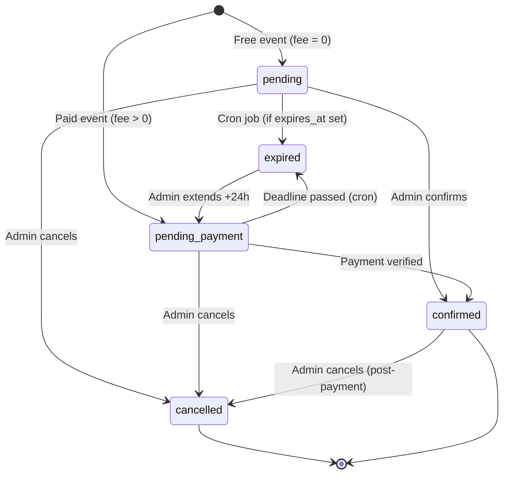
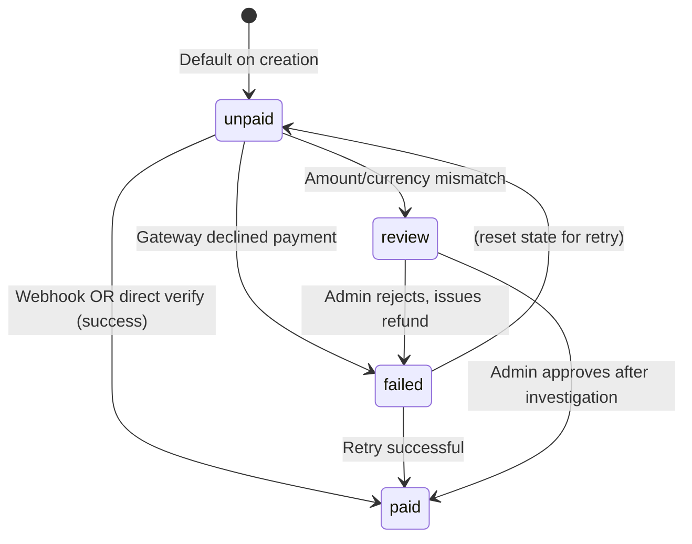
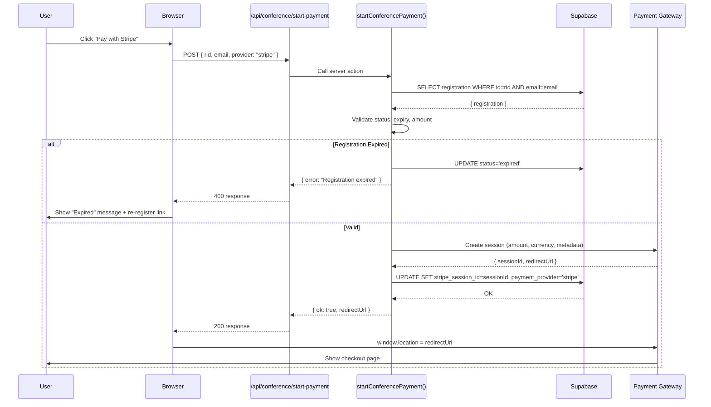
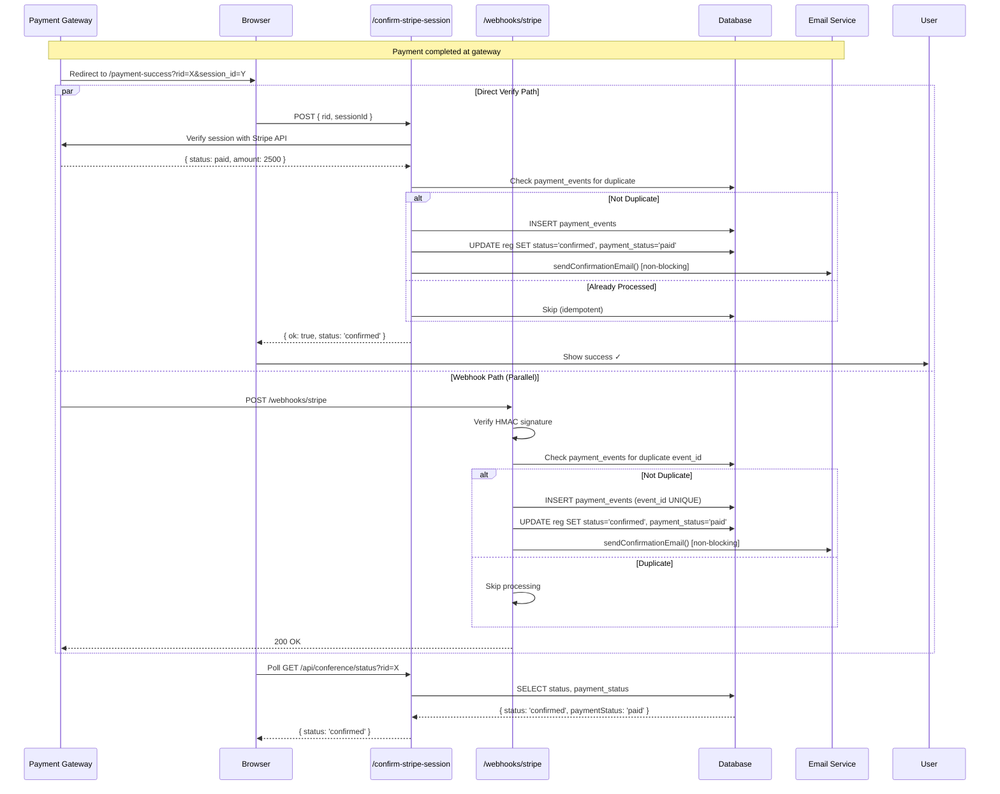

# DEESSA Foundation — Conference Module: Payment Flows & State Machines

> **Version:** 1.0.0  
> **Last Updated:** February 28, 2026  
> **Audience:** Backend Developers, Payment Engineers, QA Engineers

---

## Table of Contents

1. [Payment Gateway Comparison](#1-payment-gateway-comparison)
2. [Registration State Machine](#2-registration-state-machine)
3. [Payment Status State Machine](#3-payment-status-state-machine)
4. [Payment Initiation Flow](#4-payment-initiation-flow)
5. [Payment Verification Flow (Dual-Path)](#5-payment-verification-flow-dual-path)
6. [Provider-Specific Flows](#6-provider-specific-flows)
7. [Failure Scenarios](#7-failure-scenarios)

---

## 1. Payment Gateway Comparison

### 1.1 Provider Feature Matrix

| Feature | Stripe | Khalti | eSewa |
|---|---|---|---|
| **Region** | Global | Nepal only | Nepal only |
| **Currency** | 135+ currencies | NPR only | NPR only |
| **Payment Methods** | Credit/Debit cards, Wallets, Bank transfers | Mobile banking, Cards, Wallets | Digital wallet only |
| **Redirect Pattern** | Checkout Session (hosted page) | ePay redirect | Form POST redirect |
| **Webhook Support** | Yes (HMAC-verified) | Yes (HMAC-verified) | Limited (callback only) |
| **Test Mode** | Yes (test API keys) | Yes (sandbox) | Yes (staging environment) |
| **SDK** | Official Node.js SDK | HTTP API (no official SDK) | Form-based (no API) |
| **Session Expiry** | 24 hours | Configurable | 15 minutes (typical) |
| **Minimum Amount** | 0.50 USD | 10 NPR | 1 NPR |
| **Maximum Amount** | No limit | 100,000 NPR per txn | 100,000 NPR per txn |
| **Fee Structure** | 2.9% + $0.30 (intl cards) | 3-4% + gateway fees | 0.75% + gateway fees |
| **Settlement Time** | T+2 days | T+1 to T+3 days | T+1 day |
| **Refund Support** | Full/Partial via API | Via dashboard (manual) | Via dashboard (manual) |
| **Metadata Support** | Yes (up to 50 keys) | purchase_order_id only | transaction_uuid only |

### 1.2 Provider Selection Logic

**Determined by**:

1. Currency configuration in conference settings (`registrationFeeCurrency`)
2. Provider availability in environment variables
3. User's geographic preference (inferred from currency)

**Selection Rules**:

```typescript
if (currency === 'NPR') {
  availableProviders = ['khalti', 'esewa', 'stripe']  // NPR supports all
} else {
  availableProviders = ['stripe']  // Only Stripe for non-NPR
}

// Filter by configured providers (env variables)
availableProviders = availableProviders.filter(p => 
  p === 'stripe' ? !!process.env.STRIPE_SECRET_KEY :
  p === 'khalti' ? !!process.env.KHALTI_SECRET_KEY :
  p === 'esewa'  ? !!process.env.ESEWA_SECRET_KEY
)
```

### 1.3 Fee Comparison (Example: 2500 NPR)

| Provider | Transaction Fee | Net to Organization | User Pays |
|---|---|---|---|
| **Stripe** (NPR) | ~70 NPR (2.9%) | 2430 NPR | 2500 NPR |
| **Khalti** | ~88 NPR (3.5%) | 2412 NPR | 2500 NPR |
| **eSewa** | ~19 NPR (0.75%) | 2481 NPR | 2500 NPR |

**Note**: Fees shown are approximate; actual rates depend on contract and payment method.

### 1.4 Recommended Default Provider

**For Nepal (NPR)**:

- Primary: **eSewa** (lowest fees, highest familiarity in Nepal)
- Fallback: **Khalti** (mobile banking integration)
- Last resort: **Stripe** (higher fees for domestic)

**For International (USD/EUR)**:

- Only option: **Stripe** (Khalti/eSewa don't support)

---

## 2. Registration State Machine

### 2.1 State Diagram



### 2.2 State Transition Table

| From State | Trigger | To State | Side Effects |
|---|---|---|---|
| *(initial)* | Form submit (free) | `pending` | Email: registration received |
| *(initial)* | Form submit (paid) | `pending_payment` | Email: registration + payment link |
| `pending` | Admin confirm | `confirmed` | Email: confirmation |
| `pending` | Admin cancel | `cancelled` | Email: cancellation |
| `pending` | Expiry cron | `expired` | None |
| `pending_payment` | Payment verified | `confirmed` | Email: confirmation |
| `pending_payment` | Admin cancel | `cancelled` | Email: cancellation |
| `pending_payment` | Deadline passed | `expired` | None (cron job) |
| `pending_payment` | Admin force confirm | `confirmed` | Email: confirmation |
| `expired` | Admin extend +24h | `pending_payment` | `expires_at` = now + 24h |
| `confirmed` | Admin cancel | `cancelled` | Email: cancellation |

### 2.3 State Business Rules

**`pending`** (Legacy - free events or old data):

- No payment required
- Can be confirmed by admin without payment
- May have `expires_at` set (rare)

**`pending_payment`** (Awaiting payment):

- Payment required to confirm
- Has `expires_at` timestamp (default: now + 24 hours)
- Automatically expires if unpaid past deadline
- Admin can manually confirm (override payment)

**`confirmed`** (Registration finalized):

- Terminal state for attendee (seat secured)
- Admin can still cancel (e.g., if refund issued)
- `payment_status` may be `paid`, `unpaid`, or `review`

**`cancelled`** (Admin-terminated):

- Terminal state
- Cannot be un-cancelled (must re-register)
- May have been cancelled pre-payment or post-payment

**`expired`** (Payment deadline missed):

- Can be revived via admin "Extend +24h" action
- Moves back to `pending_payment` with new deadline

---

## 3. Payment Status State Machine

### 3.1 State Diagram



### 3.2 Payment Status vs Registration Status

**Important**: These are **independent** fields with different purposes.

| payment_status | status | Meaning |
|---|---|---|
| `unpaid` | `pending_payment` | Normal: awaiting payment |
| `paid` | `confirmed` | Normal: payment received + registration confirmed |
| `paid` | `pending_payment` | Edge case: payment received but not yet confirmed (webhook lag) |
| `unpaid` | `confirmed` | Admin override: confirmed without payment (manual payment received offline) |
| `review` | `pending_payment` | Problem: payment received but amount is wrong |
| `failed` | `pending_payment` | User tried to pay, gateway declined |

### 3.3 Payment Status Transition Table

| From | Trigger | To | Action Taken |
|---|---|---|---|
| `unpaid` | Webhook: payment succeeded | `paid` | Update `payment_provider`, `payment_id`, send confirmation email |
| `unpaid` | Direct verify: payment succeeded | `paid` | Same as above |
| `unpaid` | Gateway declined | `failed` | Set `status` to `cancelled` or leave as `pending_payment` (retry allowed) |
| `unpaid` | Amount mismatch detected | `review` | Flag for admin investigation |
| `unpaid` | Admin "Mark as Paid" | `paid` | Set `payment_override_by` = admin email, send confirmation |
| `failed` | User retries → success | `paid` | Normal flow |
| `review` | Admin approves | `paid` | Admin manually confirms after validating with gateway dashboard |
| `review` | Admin rejects | `failed` | Initiate refund via gateway dashboard |

---

## 4. Payment Initiation Flow

### 4.1 Sequence Diagram



### 4.2 Pre-Flight Validation Checks

**Before creating payment session**:

```typescript
// 1. Registration exists and email matches
const reg = await db.query('SELECT * FROM conference_registrations WHERE id = $1 AND email = $2')
if (!reg) throw new Error('Registration not found')

// 2. Not already paid
if (reg.payment_status === 'paid') throw new Error('Payment already completed')

// 3. Not confirmed (prevents double-payment)
if (reg.status === 'confirmed') throw new Error('Registration already confirmed')

// 4. Not cancelled
if (reg.status === 'cancelled') throw new Error('Registration has been cancelled')

// 5. Not expired (inline expiry check)
if (reg.expires_at && new Date(reg.expires_at) < new Date() && reg.payment_status !== 'paid') {
  await db.query('UPDATE conference_registrations SET status = $1 WHERE id = $2', ['expired', reg.id])
  throw new Error('Registration has expired')
}

// 6. Fee is configured
const fee = resolveRegistrationFee(settings, reg.attendance_mode)
if (!fee.enabled || fee.amount <= 0) throw new Error('Registration fee not configured')

// 7. Provider is supported
const supportedProviders = getSupportedProviders(settings, fee.currency)
if (!supportedProviders.includes(provider)) throw new Error('Payment provider not available')
```

### 4.3 Amount Resolution Logic

**Fee is determined by**:

1. Is `registrationFeeEnabled` true in settings?
2. If yes, check `registrationFeeByMode[attendance_mode]` (per-mode override)
3. If no per-mode fee, use `registrationFee` (global default)

```typescript
function resolveRegistrationFee(
  settings: ConferenceSettings,
  mode: 'in-person' | 'online'
): { enabled: boolean; amount: number; currency: string } {
  
  if (!settings.registrationFeeEnabled) {
    return { enabled: false, amount: 0, currency: 'NPR' }
  }
  
  // Check per-mode override
  const modeKey = normaliseModeKey(mode)  // "in-person" or "online"
  const modeAmount = settings.registrationFeeByMode?.[modeKey]
  
  if (modeAmount !== undefined && modeAmount !== null) {
    return {
      enabled: true,
      amount: modeAmount,
      currency: settings.registrationFeeCurrency || 'NPR'
    }
  }
  
  // Fallback to global fee
  return {
    enabled: true,
    amount: settings.registrationFee || 0,
    currency: settings.registrationFeeCurrency || 'NPR'
  }
}
```

**Example**:

```json
{
  "registrationFeeEnabled": true,
  "registrationFee": 2000,
  "registrationFeeCurrency": "NPR",
  "registrationFeeByMode": {
    "in-person": 2500,
    "online": 1000
  }
}
```

Result:

- In-person attendee pays: **2500 NPR**
- Online attendee pays: **1000 NPR**

---

## 5. Payment Verification Flow (Dual-Path)

### 5.1 Why Dual-Path?

**Problem**: Webhooks can be delayed or missed (network issues, gateway downtime).

**Solution**: Two parallel verification paths:

1. **Direct Verify** (client-initiated) - Fast user feedback
2. **Webhook** (server-initiated) - Production reliability

Both paths are **idempotent** and safe to run concurrently.

### 5.2 Dual-Path Sequence Diagram



### 5.3 Idempotency Mechanism

**`payment_events` table**:

```sql
CREATE TABLE payment_events (
  id uuid PRIMARY KEY,
  event_id text UNIQUE NOT NULL,  -- Stripe: evt_xxx, Khalti: pidx
  conference_registration_id uuid,
  status text,
  amount numeric,
  processed_at timestamptz
);
```

**Idempotency Check**:

```typescript
// Attempt insert
const result = await db.query(`
  INSERT INTO payment_events (event_id, conference_registration_id, status, amount)
  VALUES ($1, $2, $3, $4)
  ON CONFLICT (event_id) DO NOTHING
  RETURNING id
`, [eventId, registrationId, 'paid', amount])

if (result.rows.length === 0) {
  // Duplicate detected - skip processing
  console.log('Duplicate payment event ignored:', eventId)
  return
}

// First time seeing this event - process it
await updateRegistrationStatus(registrationId, 'confirmed', 'paid')
await sendConfirmationEmail(registrationId)
```

### 5.4 Amount Verification

**Critical Security Check**:

```typescript
// Direct verify (Stripe)
const session = await stripe.checkout.sessions.retrieve(sessionId)

const expectedMinor = Math.round(Number(registration.payment_amount) * 100)  // Convert to cents
const actualMinor = session.amount_total

if (expectedMinor !== actualMinor) {
  // FAIL: Amount mismatch detected
  await db.query(`
    UPDATE conference_registrations
    SET payment_status = 'review'
    WHERE id = $1
  `, [registrationId])
  
  // Alert admin
  console.error('Payment amount mismatch:', {
    registrationId,
    expected: expectedMinor,
    actual: actualMinor
  })
  
  return { status: 'review', message: 'Amount mismatch - admin review required' }
}

// Amount verified - proceed with confirmation
```

**Why verify amount?**

- Prevents client-side amount tampering
- Catches configuration errors (settings changed mid-payment)
- Protects against replay attacks with modified amount

---

## 6. Provider-Specific Flows

### 6.1 Stripe Flow

**Step 1: Create Checkout Session**

```typescript
const session = await stripe.checkout.sessions.create({
  payment_method_types: ['card'],
  line_items: [{
    price_data: {
      currency: currency.toLowerCase(),
      unit_amount: Math.round(amount * 100),  // Convert to minor units
      product_data: {
        name: 'Conference Registration',
        description: `${settings.conferenceName} - ${attendanceMode}`
      }
    },
    quantity: 1
  }],
  mode: 'payment',
  success_url: `${baseUrl}/conference/register/payment-success?rid=${registrationId}&session_id={CHECKOUT_SESSION_ID}`,
  cancel_url: `${baseUrl}/conference/register/pending-payment?rid=${registrationId}&email=${email}`,
  metadata: {
    conference_registration_id: registrationId,
    payment_type: 'conference_registration'
  }
})
```

**Step 2: Store Session Reference**

```sql
UPDATE conference_registrations
SET 
  stripe_session_id = $1,
  payment_provider = 'stripe',
  payment_id = 'stripe:' || $1,
  provider_ref = $1
WHERE id = $2;
```

**Step 3: Redirect User**

```typescript
return { redirectUrl: session.url, requiresFormSubmit: false }
```

**Step 4: User Completes Payment at Stripe**

**Step 5: Stripe Redirects Back**

```
https://deessa.org/conference/register/payment-success?rid=abc&session_id=cs_live_123
```

**Step 6: Direct Verification**

```typescript
const session = await stripe.checkout.sessions.retrieve(sessionId)

if (session.payment_status === 'paid') {
  // Confirm registration
}
```

**Step 7: Webhook (Parallel)**

```typescript
// POST /api/webhooks/stripe
const event = stripe.webhooks.constructEvent(body, signature, webhookSecret)

if (event.type === 'checkout.session.completed') {
  const session = event.data.object
  const registrationId = session.metadata.conference_registration_id
  
  // Confirm registration (idempotent)
}
```

---

### 6.2 Khalti Flow

**Step 1: Initiate Payment**

```typescript
const response = await fetch('https://khalti.com/api/v2/epayment/initiate/', {
  method: 'POST',
  headers: {
    'Authorization': `Key ${KHALTI_SECRET_KEY}`,
    'Content-Type': 'application/json'
  },
  body: JSON.stringify({
    return_url: `${baseUrl}/conference/register/payment-success?rid=${registrationId}`,
    website_url: baseUrl,
    amount: Math.round(amount * 100),  // Paisa (1 NPR = 100 paisa)
    purchase_order_id: registrationId,
    purchase_order_name: 'Conference Registration',
    customer_info: {
      name: fullName,
      email: email,
      phone: phone
    }
  })
})

const data = await response.json()
// Returns: { pidx, payment_url, expires_at, expires_in }
```

**Step 2: Store pidx Reference**

```sql
UPDATE conference_registrations
SET 
  khalti_pidx = $1,
  payment_provider = 'khalti',
  payment_id = 'khalti:' || $1,
  provider_ref = $1
WHERE id = $2;
```

**Step 3: Redirect User**

```typescript
return { redirectUrl: data.payment_url, requiresFormSubmit: false }
```

**Step 4: Khalti Redirects Back**

```
https://deessa.org/conference/register/payment-success?rid=abc&pidx=kdZJqDr...
```

**Step 5: Direct Verification (Lookup)**

```typescript
const response = await fetch('https://khalti.com/api/v2/epayment/lookup/', {
  method: 'POST',
  headers: { 'Authorization': `Key ${KHALTI_SECRET_KEY}` },
  body: JSON.stringify({ pidx })
})

const data = await response.json()

if (data.status === 'Completed') {
  // Confirm registration
}
```

**Step 6: Webhook (if configured)**

```typescript
// Khalti calls callback URL with HMAC verification
```

---

### 6.3 eSewa Flow

**Step 1: Generate Signature**

```typescript
const message = `total_amount=${amount},transaction_uuid=${uuid},product_code=${ESEWA_PRODUCT_CODE}`
const signature = crypto
  .createHmac('sha256', ESEWA_SECRET_KEY)
  .update(message)
  .digest('base64')
```

**Step 2: Return Form Data**

```typescript
return {
  redirectUrl: 'https://esewa.com.np/epay/main',
  formData: {
    amount: amount.toString(),
    tax_amount: '0',
    total_amount: amount.toString(),
    transaction_uuid: uuid,
    product_code: ESEWA_PRODUCT_CODE,
    product_service_charge: '0',
    product_delivery_charge: '0',
    success_url: `${baseUrl}/conference/register/payment-success?rid=${registrationId}`,
    failure_url: `${baseUrl}/conference/register/failure?rid=${registrationId}`,
    signed_field_names: 'total_amount,transaction_uuid,product_code',
    signature
  },
  requiresFormSubmit: true
}
```

**Step 3: Client Submits Form**

```typescript
// Client-side (in pending-payment page)
const form = document.createElement('form')
form.method = 'POST'
form.action = data.redirectUrl

Object.entries(data.formData).forEach(([key, value]) => {
  const input = document.createElement('input')
  input.type = 'hidden'
  input.name = key
  input.value = value
  form.appendChild(input)
})

document.body.appendChild(form)
form.submit()
```

**Step 4: eSewa Processes Payment**

**Step 5: eSewa Redirects to success_url**

**Step 6: Verification**

```typescript
// eSewa provides transaction details in callback
// System verifies signature and confirms registration
```

---

## 7. Failure Scenarios

### 7.1 Failure Mode Matrix

| Failure | Detection | User Impact | Recovery |
|---|---|---|---|
| **User abandons payment** | Timeout (no return redirect) | Payment incomplete | Status stays `pending_payment`; can retry |
| **Gateway declines card** | Gateway returns failure status | Payment failed | User sees error; can try different card/method |
| **Amount mismatch** | Direct verify compares amounts | Payment held for review | Admin investigates; refunds if wrong |
| **Session expired** | Gateway returns expired status | Cannot pay | Must register again (new expiry window) |
| **Webhook missed** | No webhook received within 5 min | Possible delay | Direct verify catches it; polling confirms |
| **Both webhook and direct fail** | Both return errors | Processing timeout | Admin manually verifies in gateway dashboard |
| **Registration expired before payment** | Pre-flight check detects | Payment blocked | Must register again |
| **Double payment attempt** | Pre-flight check (`payment_status === 'paid'`) | Payment blocked | User informed already paid |
| **Email delivery failure** | SMTP error logged | No email received | Admin can resend via dashboard |

### 7.2 Timeout Handling

**Payment Success Page Polling**:

- **Polling interval**: 5 seconds
- **Max polls**: 18 (90 seconds total)
- **On timeout**: Show message "Verification taking longer than expected. Check your email or contact support."

**User Actions on Timeout**:

- Check email for confirmation
- Contact support with registration ID
- Admin can manually verify in dashboard

### 7.3 Retry Logic

**Payment Initiation**:

- **No automatic retry** (avoids duplicate charges)
- User must manually click "Try Again"

**Webhook Processing**:

- **Gateway's responsibility** - Stripe/Khalti retry webhooks automatically (exponential backoff)
- System must be idempotent to handle retries

**Email Sending**:

- **No retry** in current implementation (fire-and-forget)
- Recommended: Add queue with retry for production

---

## Related Documentation

- **Previous**: [05: API Documentation](05-api-documentation.md)
- **Next**: [07: Admin Documentation](07-admin-documentation.md)
- **See Also**: [03: Database Schema](03-database-schema.md), [08: Security](08-security.md)

---

**Document Maintained By**: Development Partner  
**Last Reviewed**: February 28, 2026
