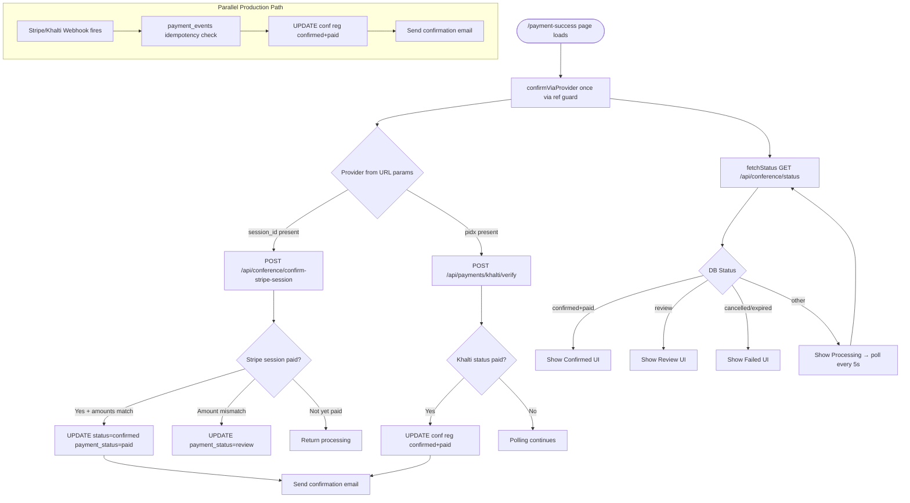
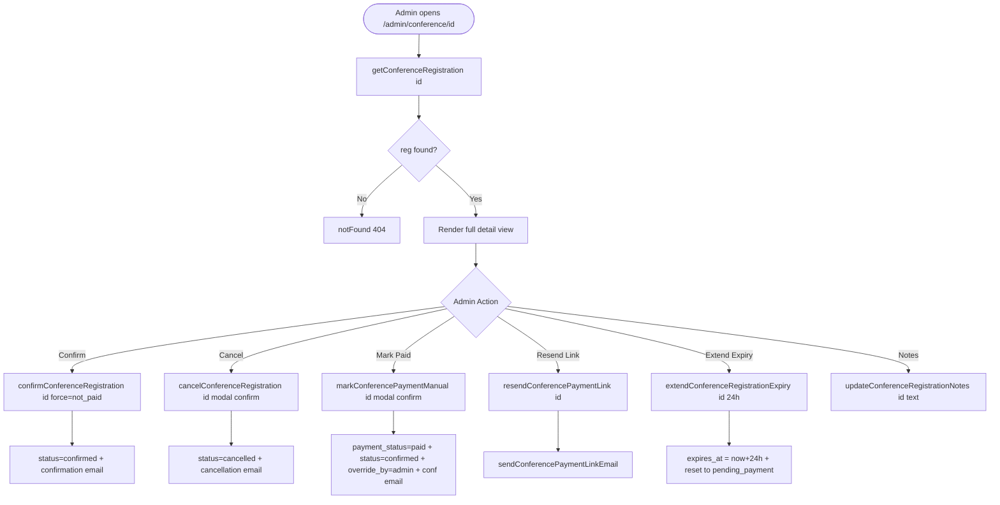
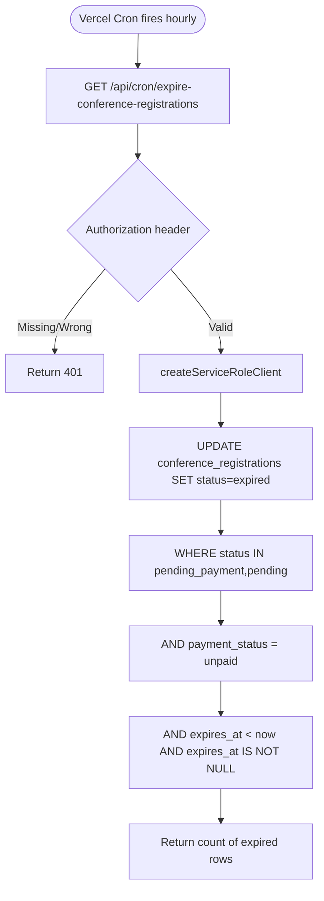

# DEESSA Foundation — Conference Module: Complete Technical Documentation

> **Scope:** All files that directly or indirectly affect the Conference feature as of codebase snapshot (Feb 2026).  
> **Purpose:** Developer onboarding, code review, production audit, and future scaling reference.

---

## Table of Contents

1. [High-Level Architecture Overview](#1-high-level-architecture-overview)
2. [Feature Breakdown](#2-feature-breakdown)
3. [Page-Level Documentation](#3-page-level-documentation)
4. [API Documentation](#4-api-documentation)
5. [Payment Flow Documentation](#5-payment-flow-documentation)
6. [Registration State Machine](#6-registration-state-machine)
7. [Admin Flow Documentation](#7-admin-flow-documentation)
8. [Flow Diagrams](#8-flow-diagrams)
9. [Security Considerations](#9-security-considerations)
10. [Improvement Opportunities](#10-improvement-opportunities)

---

## 1. High-Level Architecture Overview

### 1.1 Technology Stack

| Layer | Technology |
|---|---|
| Framework | Next.js 14 (App Router) |
| Language | TypeScript |
| Database | Supabase (PostgreSQL + RLS) |
| Auth | Supabase Auth (admin-only; public pages are unauthenticated) |
| Email | Nodemailer → Google Gmail SMTP |
| Payments | Stripe (global), Khalti (Nepal), eSewa (Nepal) |
| Cron | Vercel Cron Jobs |
| Hosting | Vercel |

### 1.2 System Topology

```
┌─────────────────────────────────────────┐
│           PUBLIC USERS (No Auth)        │
│                                         │
│  /conference          (landing page)    │
│  /conference/register (4-step form)     │
│  /conference/register/payment-options   │
│  /conference/register/pending-payment   │
│  /conference/register/payment-success   │
│  /conference/register/success           │
│  /conference/register/failure           │
└────────────────┬────────────────────────┘
                 │  Server Actions / Fetch
                 ▼
┌─────────────────────────────────────────┐
│            API LAYER (Next.js Routes)   │
│                                         │
│  /api/conference/start-payment          │
│  /api/conference/verify-registration    │
│  /api/conference/confirm-stripe-session │
│  /api/conference/status                 │
│  /api/conference/resend-payment-link    │
│  /api/cron/expire-conference-regs...    │
└────────────────┬────────────────────────┘
                 │  Server Actions (direct call)
                 ▼
┌─────────────────────────────────────────┐
│       SERVER ACTIONS (lib/actions/)     │
│                                         │
│  conference-registration.ts             │
│  conference-settings.ts                 │
└────────────┬──────┬─────────────────────┘
             │      │
             ▼      ▼
┌────────────┐  ┌──────────────────────────┐
│ Supabase   │  │  Payment Providers       │
│ PostgreSQL │  │  stripe.ts / khalti.ts   │
│ + RLS      │  │  esewa.ts                │
└────────────┘  └──────────────────────────┘
             │
             ▼
┌─────────────────────────────────────────┐
│         EMAIL (lib/email/)              │
│  conference-mailer.ts (Nodemailer)      │
│  Gmail SMTP (GOOGLE_EMAIL + APP_PASS)   │
└─────────────────────────────────────────┘

┌─────────────────────────────────────────┐
│           ADMIN USERS (Auth Required)   │
│                                         │
│  /admin/conference        (list/stats)  │
│  /admin/conference/[id]   (detail)      │
│  /admin/conference/settings             │
└─────────────────────────────────────────┘
```

### 1.3 Data Flow Summary

1. Public user visits `/conference` → settings fetched from DB via [getConferenceSettings()](file:///d:/Web%20Codes/Projects/Deesha%20Foundation/lib/actions/conference-settings.ts#12-45).
2. User fills 4-step form at `/conference/register` → Server Action [registerForConference()](file:///d:/Web%20Codes/Projects/Deesha%20Foundation/lib/actions/conference-registration.ts#793-1522) called.
3. If fee required: record is `pending_payment`, expiry set to `now + expiryHours`.
4. User redirected to `/payment-options` → chooses Pay Now or Pay Later.
5. Pay Now → `/pending-payment` page → calls `POST /api/conference/start-payment` → provider SDK creates payment session → user redirected to gateway.
6. On return: `/payment-success` page hits **confirm-stripe-session** or **khalti/verify** endpoint, then polls `/api/conference/status`.
7. Webhook (Stripe / Khalti) fires in parallel for production reliability → `payment_events` idempotency check → DB update → email.
8. Cron (hourly) marks overdue `pending_payment` records as `expired`.
9. Admin can manually confirm, cancel, override payment, resend links, or extend expiry from `/admin/conference/[id]`.

---

## 2. Feature Breakdown

### 2.1 Public Conference Landing Page

| Attribute | Detail |
|---|---|
| Purpose | Marketing page showcasing conference details, agenda, venue |
| Key Design | All content (name, dates, venue, agenda) is **dynamic** — read from `conference_settings` stored in DB |
| API Called | [getConferenceSettings()](file:///d:/Web%20Codes/Projects/Deesha%20Foundation/lib/actions/conference-settings.ts#12-45) (server-side, direct action call) |
| Files | [app/(public)/conference/page.tsx](file:///d:/Web%20Codes/Projects/Deesha%20Foundation/app/%28public%29/conference/page.tsx), [lib/actions/conference-settings.ts](file:///d:/Web%20Codes/Projects/Deesha%20Foundation/lib/actions/conference-settings.ts) |

### 2.2 Registration System (4-Step Multi-Step Form)

| Attribute | Detail |
|---|---|
| Purpose | Collects all attendee data in a guided wizard |
| Steps | 1. Personal Details → 2. Participation → 3. Additional Info → 4. Review |
| Trigger | On Step 4 submit: calls [registerForConference()](file:///d:/Web%20Codes/Projects/Deesha%20Foundation/lib/actions/conference-registration.ts#793-1522) server action |
| Result | Creates `conference_registrations` row, sends registration email |
| Files | [components/conference/conference-registration-form.tsx](file:///d:/Web%20Codes/Projects/Deesha%20Foundation/components/conference/conference-registration-form.tsx), [step1-personal-details.tsx](file:///d:/Web%20Codes/Projects/Deesha%20Foundation/components/conference/step1-personal-details.tsx) – [step4-review.tsx](file:///d:/Web%20Codes/Projects/Deesha%20Foundation/components/conference/step4-review.tsx) |

**Data collected:**

- Full name, email, phone, organization
- Role (attendee/speaker/panelist/volunteer/sponsor)
- Attendance mode (`in-person` / `online`)
- Workshop selections
- Dietary preference, T-shirt size, heard_via sources
- Emergency contact name and phone
- Consent to terms and newsletter

**Fee Logic on Submit:**

```
cfg = getConferenceSettings()
fee = resolveRegistrationFee(cfg, data.attendanceMode)
if fee.enabled && fee.amount > 0:
  status = "pending_payment"
  expires_at = now + cfg.registrationExpiryHours hours
  paymentRequired = true
else:
  status = "pending"
  paymentRequired = false
```

### 2.3 Payment Gate (Multi-Provider)

| Attribute | Detail |
|---|---|
| Purpose | Collects registration fee before confirming seat |
| Providers | Stripe (global), Khalti (NPR), eSewa (NPR) |
| Currency | Configurable (NPR / USD); Khalti and eSewa are NPR-only |
| Amount source | Always resolved server-side from `conference_settings`; DB `payment_amount` is only a snapshot for audit |
| Fee per mode | Optional per-attendance-mode fee override in `registrationFeeByMode` map |

### 2.4 Conference Settings (Admin-Configurable)

| Attribute | Detail |
|---|---|
| Purpose | Centralises all conference content — eliminates hardcoded strings |
| Storage | `site_settings` table, key `conference_settings`, JSON value |
| Schema | [ConferenceSettings](file:///d:/Web%20Codes/Projects/Deesha%20Foundation/lib/conference-settings-defaults.ts#17-46) interface (conference-settings-defaults.ts) |
| Deep merge | Admin partial saves are merged with `CONFERENCE_DEFAULTS` so missing keys always have valid defaults |
| Payment fields | `registrationFeeEnabled`, `registrationFee`, `registrationFeeCurrency`, `registrationFeeByMode`, `registrationExpiryHours` |

### 2.5 Email Notifications

Five email types sent via Gmail SMTP through Nodemailer:

| Email | Trigger | Template |
|---|---|---|
| Registration Received | On form submit (always) | [conference-registration.ts](file:///d:/Web%20Codes/Projects/Deesha%20Foundation/lib/actions/conference-registration.ts) |
| Confirmation | Admin confirms OR payment verified | [conference-confirmation.ts](file:///d:/Web%20Codes/Projects/Deesha%20Foundation/lib/email/templates/conference-confirmation.ts) |
| Cancellation | Admin cancels | [conference-cancellation.ts](file:///d:/Web%20Codes/Projects/Deesha%20Foundation/lib/email/templates/conference-cancellation.ts) |
| Payment Link | On pending_payment registration | HTML inline in [conference-mailer.ts](file:///d:/Web%20Codes/Projects/Deesha%20Foundation/lib/email/conference-mailer.ts) |
| Custom Admin Email | Admin Quick Action | HTML inline in [conference-mailer.ts](file:///d:/Web%20Codes/Projects/Deesha%20Foundation/lib/email/conference-mailer.ts) |

All email sends are **non-blocking** (fired with `.catch()`) so email failures never crash the registration flow.

### 2.6 Expiry Cron Job

| Attribute | Detail |
|---|---|
| Purpose | Automatically expires unpaid registrations after configured window |
| Schedule | Hourly (configured in [vercel.json](file:///d:/Web%20Codes/Projects/Deesha%20Foundation/vercel.json)) |
| Auth | `CRON_SECRET` Bearer token |
| Logic | Bulk UPDATE: `status = 'expired'` where `status IN ('pending_payment','pending') AND payment_status = 'unpaid' AND expires_at < now()` |
| Belt and suspenders | [startConferencePayment()](file:///d:/Web%20Codes/Projects/Deesha%20Foundation/lib/actions/conference-registration.ts#1761-3165) also marks expired inline when user tries to pay |

---

## 3. Page-Level Documentation

### 3.1 `/conference` — Public Landing Page

| Field | Detail |
|---|---|
| Route | [app/(public)/conference/page.tsx](file:///d:/Web%20Codes/Projects/Deesha%20Foundation/app/%28public%29/conference/page.tsx) |
| Rendering | Server Component (SSR) |
| Purpose | Showcase event, drive registrations |
| Components | Hero section, Why Attend cards, Agenda timeline, Venue map (iframe), CTA banner |
| Server calls | [getConferenceSettings()](file:///d:/Web%20Codes/Projects/Deesha%20Foundation/lib/actions/conference-settings.ts#12-45) |
| State | None (fully static render from DB) |
| SEO | Page-level `metadata` + single H1 |

### 3.2 `/conference/register` — Registration Form

| Field | Detail |
|---|---|
| Route | [app/(public)/conference/register/page.tsx](file:///d:/Web%20Codes/Projects/Deesha%20Foundation/app/%28public%29/conference/register/page.tsx) |
| Rendering | Client Component shell (`ConferenceRegistrationForm`) |
| Purpose | Collect registration data |
| Components | [step-progress-bar.tsx](file:///d:/Web%20Codes/Projects/Deesha%20Foundation/components/conference/step-progress-bar.tsx), [step1-personal-details.tsx](file:///d:/Web%20Codes/Projects/Deesha%20Foundation/components/conference/step1-personal-details.tsx) through [step4-review.tsx](file:///d:/Web%20Codes/Projects/Deesha%20Foundation/components/conference/step4-review.tsx) |
| API calls | On submit: [registerForConference()](file:///d:/Web%20Codes/Projects/Deesha%20Foundation/lib/actions/conference-registration.ts#793-1522) server action |
| State | Multi-step form state held in parent [conference-registration-form.tsx](file:///d:/Web%20Codes/Projects/Deesha%20Foundation/components/conference/conference-registration-form.tsx) |
| Post-submit | If `paymentRequired`: redirect to `/payment-options?rid=...&email=...&amount=...` |
|             | If free: redirect to `/success` |

### 3.3 `/conference/register/payment-options` — Pay Now or Pay Later

| Field | Detail |
|---|---|
| Route | [app/(public)/conference/register/payment-options/page.tsx](file:///d:/Web%20Codes/Projects/Deesha%20Foundation/app/%28public%29/conference/register/payment-options/page.tsx) |
| Rendering | Client Component |
| Purpose | Give user explicit choice before sending them to payment gateway |
| URL Params | `rid`, `email`, `amount`, `currency`, `name`, `expiryHours` |
| Pay Now path | Links to `/pending-payment?rid=...&email=...` |
| Pay Later action | `POST /api/conference/resend-payment-link` (non-blocking re-send) |
| State | `emailSent`, `sendingEmail` (local) |

### 3.4 `/conference/register/pending-payment` — Payment Selection

| Field | Detail |
|---|---|
| Purpose | Let user pick payment provider (Stripe/Khalti/eSewa) and initiate session |
| Rendering | Client Component |
| On provider select | `POST /api/conference/start-payment` with `{registrationId, email, provider}` |
| On success | Redirects to gateway URL (Stripe, Khalti) or submits eSewa form |
| State dependencies | `rid`, `email` from URL params; provider list from API response |

### 3.5 `/conference/register/payment-success` — Post-Payment Verification

| Field | Detail |
|---|---|
| Route | [app/(public)/conference/register/payment-success/page.tsx](file:///d:/Web%20Codes/Projects/Deesha%20Foundation/app/%28public%29/conference/register/payment-success/page.tsx) |
| Rendering | Client Component |
| Purpose | Verify payment directly with provider, then show confirmed/processing/failed state |
| URL Params | `rid`, `session_id` (Stripe), `pidx` (Khalti) |
| Step 1 | Direct provider verify (confirm-stripe-session or khalti/verify) |
| Step 2 | Poll `GET /api/conference/status?rid=...` every 5s |
| Max polls | 18 × 5s = 90 seconds before timeout message |
| States rendered | loading → confirmed / processing / review / failed |
| Idempotency guard | `useRef(hasVerified)` prevents double-verify on React StrictMode |

### 3.6 Admin Pages

| Page | Route | Purpose |
|---|---|---|
| Registration List | `/admin/conference` | Stats summary + full table with status/payment badges |
| Registrant Detail | `/admin/conference/[id]` | Full PII view + admin actions |
| Settings | `/admin/conference/settings` | Conference configuration form |

---

## 4. API Documentation

### 4.1 `POST /api/conference/start-payment`

| Field | Detail |
|---|---|
| Purpose | Create payment session with chosen provider |
| Auth | None (public) — dual-key (rid+email) verification in action |
| Rate Limit | 10 req/min per IP (in-memory, best-effort on serverless) |

**Request Body:**

```json
{
  "registrationId": "uuid",
  "email": "user@example.com",
  "provider": "stripe" | "khalti" | "esewa"
}
```

**Response (success):**

```json
{
  "ok": true,
  "redirectUrl": "https://checkout.stripe.com/...",
  "requiresFormSubmit": false
}
```

**Response (eSewa — requires form POST):**

```json
{
  "ok": true,
  "redirectUrl": "https://esewa.com.np/...",
  "formData": { "amount": "2500", "signature": "..." },
  "requiresFormSubmit": true
}
```

**Validation logic:**

- `registrationId` must be non-empty string
- `email` must contain `@`
- `provider` must be one of `['stripe', 'khalti', 'esewa']`
- Pre-verify registration token before invoking [startConferencePayment()](file:///d:/Web%20Codes/Projects/Deesha%20Foundation/lib/actions/conference-registration.ts#1761-3165)
- Returns `404` with generic message if registration not found (prevents ID enumeration)

**Database interaction:**

- Reads `conference_registrations` via service-role (bypasses RLS)
- Writes payment provider refs, session IDs back to the row
- Calls `startStripeCheckout()`, `startKhaltiPayment()`, or `startEsewaPayment()`

**Edge cases:**

- Provider not in `availableProviders` → falls back to first available
- Fee is 0 even with `registrationFeeEnabled` → error: "fee not configured"
- Registration already `paid` / `confirmed` / `cancelled` / `expired` → blocked with specific messages
- Expiry check inline → marks `expired` and blocks payment

---

### 4.2 `POST /api/conference/confirm-stripe-session`

| Field | Detail |
|---|---|
| Purpose | Verify Stripe session directly after redirect-back (no webhook dependency) |
| Auth | None (public) — requires `rid` + `sessionId` pair |
| Called by | `/payment-success` page on mount |

**Request Body:**

```json
{ "rid": "uuid", "sessionId": "cs_live_..." }
```

**Response (confirmed):**

```json
{ "ok": true, "status": "confirmed" }
```

**Response (already confirmed — idempotent):**

```json
{ "ok": true, "status": "confirmed", "alreadyConfirmed": true }
```

**Response (amount mismatch):**

```json
{ "ok": true, "status": "review" }
```

**Security:**

- `sessionId` verified against `reg.stripe_session_id` in DB — prevents session ID injection
- Amount verified: `Math.round(payment_amount * 100) === session.amount_total`
- Currency mismatch is non-fatal (syncs DB currency to Stripe's reported currency)
- Amount mismatch → sets `payment_status = 'review'` for admin triage

**Database interaction:**

- Reads registration by `rid`
- Updates: `status = 'confirmed'`, `payment_status = 'paid'`, `payment_provider = 'stripe'`, `payment_id = 'stripe:{sessionId}'`
- Non-blocking: sends confirmation email via [sendConferenceConfirmationEmail()](file:///d:/Web%20Codes/Projects/Deesha%20Foundation/lib/email/conference-mailer.ts#72-100)

---

### 4.3 `GET /api/conference/verify-registration`

| Field | Detail |
|---|---|
| Purpose | Lookup registration for the payment link page (shared by email link) |
| Auth | None (public) — dual-key (rid+email) |
| Rate Limit | 60 req/min per IP |

**Query params:** `?rid=uuid&email=user@example.com`

**Response:**

```json
{
  "ok": true,
  "id": "uuid",
  "status": "pending_payment",
  "paymentStatus": "unpaid",
  "paymentAmount": 2500,
  "paymentCurrency": "NPR",
  "expiresAt": "2026-10-15T12:00:00Z",
  "attendanceMode": "in-person",
  "fullName": "Jane Doe",
  "expiryHours": 24,
  "expired": false
}
```

**Edge cases:**

- `paymentAmount` may be `null` in DB if record pre-dates fee configuration → resolved live from current settings
- `expired: true` computed from `status === 'expired'` OR `expires_at < now() AND payment_status !== 'paid'`
- Returns `404` with generic message to prevent ID enumeration

---

### 4.4 `GET /api/conference/status`

| Field | Detail |
|---|---|
| Purpose | Lightweight status-poll endpoint for the payment-success page |
| Auth | None (public) — by `rid` only |
| Note | No email required — used only after provider redirects back with `rid` in URL |

**Query params:** `?rid=uuid`

**Response:**

```json
{
  "ok": true,
  "status": "confirmed",
  "paymentStatus": "paid",
  "fullName": "Jane Doe",
  "attendanceMode": "in-person",
  "expiresAt": null
}
```

**Only safe public fields returned** — no full PII (no email, phone, org etc.).

---

### 4.5 `POST /api/conference/resend-payment-link`

| Field | Detail |
|---|---|
| Purpose | Re-send payment link email to registrant |
| Auth | None — security delegated to [resendConferencePaymentLink()](file:///d:/Web%20Codes/Projects/Deesha%20Foundation/lib/actions/conference-registration.ts#4812-5045) action (dual-key check inside) |

**Request Body:**

```json
{ "registrationId": "uuid", "email": "user@example.com" }
```

**Note:** The `email` in the body is validated at API level but the server action uses the stored DB email for the actual send (preventing email redirect attacks).

---

### 4.6 `GET /api/cron/expire-conference-registrations`

| Field | Detail |
|---|---|
| Purpose | Bulk-expire overdue unpaid registrations |
| Auth | `Authorization: Bearer {CRON_SECRET}` — returns 401 without it |
| Caller | Vercel Cron (hourly) |

**Response:**

```json
{ "ok": true, "expired": 3, "timestamp": "2026-01-15T01:00:00Z" }
```

---

### 4.7 `GET /api/admin/conference/export`

| Field | Detail |
|---|---|
| Purpose | Export all registrations as CSV |
| Auth | Admin authenticated session (Supabase Auth) |
| Route | [app/api/admin/conference/export/route.ts](file:///d:/Web%20Codes/Projects/Deesha%20Foundation/app/api/admin/conference/export/route.ts) |

---

## 5. Payment Flow Documentation

### 5.1 Payment Initiation Flow

```
User on /pending-payment page
        │
        ▼
POST /api/conference/start-payment
        │
        ▼
startConferencePayment() [lib/actions/conference-registration.ts]
        │
        ├─ Fetch registration (service-role, id+email check)
        ├─ Guard checks:
        │   ├─ payment_status === 'paid'     → block
        │   ├─ status === 'confirmed'         → block
        │   ├─ status === 'cancelled'         → block
        │   ├─ status === 'expired'           → block
        │   └─ expires_at < now              → mark expired, block
        │
        ├─ resolveRegistrationFee(cfg, reg.attendance_mode)
        │   ├─ registrationFeeEnabled = false → block (no payment needed)
        │   ├─ registrationFeeByMode[mode]    → per-mode override
        │   └─ fallback → cfg.registrationFee
        │
        ├─ fee.amount <= 0                   → block with config error
        │
        ├─ getSupportedProviders(settings)   → validate provider
        │
        └─ Provider dispatch:
            ├─ stripe   → startStripeCheckout() → Checkout Session URL
            ├─ khalti   → startKhaltiPayment()  → Khalti ePay URL + pidx
            └─ esewa    → startEsewaPayment()   → form POST data + URL
                │
                ▼
        UPDATE conference_registrations SET
            payment_provider, payment_amount, payment_currency,
            stripe_session_id | khalti_pidx | esewa_transaction_uuid,
            provider_ref, payment_id
        WHERE id = registrationId
                │
                ▼
        Return { ok: true, redirectUrl, formData?, requiresFormSubmit }
```

### 5.2 Stripe-Specific Metadata

When creating the Stripe Checkout Session, the following metadata is attached:

```json
{
  "conference_registration_id": "<uuid>",
  "payment_type": "conference_registration"
}
```

This allows the Stripe webhook handler to distinguish conference payments from donation payments and route accordingly.

**Success URL:** `/conference/register/payment-success?rid={registrationId}`  
**Cancel URL:** `/conference/register/pending-payment?rid={registrationId}&email={email}`

### 5.3 Khalti-Specific Flow

Khalti returns a `pidx` (payment intent ID) on initiation. On success, Khalti redirects to:

```
/conference/register/payment-success?rid={registrationId}&pidx={pidx}
```

The success page calls `POST /api/payments/khalti/verify` with `{ pidx, purchase_order_id: rid }`.

### 5.4 eSewa-Specific Flow

eSewa uses a form-POST model: the success page receives `formData` and `requiresFormSubmit: true`. A hidden HTML form is dynamically created and submitted to the eSewa URL. eSewa later calls a callback URL for verification.

### 5.5 Post-Payment Verification (Client-Side)

On return to `/payment-success`:

```
Mount:
└─ confirmViaProvider() [once, guarded by hasVerified ref]
    ├─ Stripe: POST /api/conference/confirm-stripe-session { rid, sessionId }
    └─ Khalti: POST /api/payments/khalti/verify { pidx, purchase_order_id: rid }

After confirm:
└─ fetchStatus() → GET /api/conference/status?rid=...
    └─ Map DB fields to UI state

If status === 'processing':
└─ Poll every 5s (max 18 polls = 90s)
    └─ fetchStatus() again
    └─ pollCount === 0: retry confirmViaProvider() in case DB was slow
```

### 5.6 Webhook Processing (Production)

The existing Stripe webhook handler (`/api/webhooks/stripe/route.ts`) and Khalti callback handler check for `payment_type === 'conference_registration'` in metadata/purchase_order_id and update `conference_registrations` accordingly. This is the **production source of truth** alongside the direct-verify flow above.

**Idempotency:** The `payment_events` table has a `conference_registration_id` column added in migration `017`. This allows idempotency checks to be scoped per conference registration, preventing duplicate processing when both the direct-verify and webhook fire.

### 5.7 Payment Status Transitions

```
unpaid
  ├─▶ [Provider session created — no status change yet]
  ├─▶ paid      (webhook OR direct-verify confirmed payment)
  ├─▶ failed    (gateway confirmed failure)
  └─▶ review    (amount/currency mismatch — admin must triage)
```

### 5.8 Failure Handling

| Failure scenario | Handling |
|---|---|
| User abandons payment (closes gateway tab) | Status stays `unpaid`; they can try again before `expires_at` |
| Payment declined by gateway | `payment_status = 'failed'`; user shown "Try Again" link |
| Amount mismatch detected | `payment_status = 'review'`; admin alerted via badge in admin panel |
| Stripe session ID mismatch | `403` returned; registration not confirmed |
| Registration expired before payment | Blocked in [startConferencePayment()](file:///d:/Web%20Codes/Projects/Deesha%20Foundation/lib/actions/conference-registration.ts#1761-3165); user told to register again |
| Fee not configured (amount = 0) | Specific error: "Please set a fee amount in Conference Settings" |
| No payment providers configured | Server action returns graceful error: "No payment methods available" |

---

## 6. Registration State Machine

### 6.1 Registration Status (`status`)

```
                         ┌─────────────────────────────┐
                         │                             │
                   ┌─────▼──────┐              ┌───────▼──────┐
   Form Submit ──▶ │  pending   │              │pending_payment│◀─ Form Submit
  (fee = 0)        │ (legacy)   │              │  (fee > 0)   │   (fee > 0)
                   └─────┬──────┘              └──────┬───────┘
                         │                           │
                   Admin Confirm           Payment Verified (webhook/
                  (without payment)        direct-verify) OR Admin Confirm
                         │                           │
                         └──────────┬────────────────┘
                                    │
                              ┌─────▼──────┐
                              │ confirmed  │◀─ markConferencePaymentManual()
                              └─────┬──────┘     (admin override)
                                    │
                                    │ Admin Cancel
                                    ▼
                              ┌────────────┐
                              │ cancelled  │
                              └────────────┘

From pending / pending_payment:
  ├─ expires_at < now() AND payment_status = 'unpaid'
  │   └──▶ expired  (cron or inline check in startConferencePayment)
  └─ Admin Cancel
      └──▶ cancelled
```

### 6.2 Payment Status (`payment_status`)

| Status | Meaning | Set By |
|---|---|---|
| `unpaid` | Default. No successful payment initiated | DB INSERT default |
| `paid` | Payment verified by gateway or admin | `confirm-stripe-session`, Khalti verify, webhook, Admin override |
| `failed` | Gateway explicitly declined | Webhook or verify endpoint on failure response |
| `review` | Payment received but amount/currency mismatch | `confirm-stripe-session` on mismatch detection |

### 6.3 Complete State Transition Table

| From Status | From PaymentStatus | Trigger | To Status | To PaymentStatus |
|---|---|---|---|---|
| `pending` | `unpaid` | Admin Confirm | `confirmed` | unchanged |
| `pending_payment` | `unpaid` | Payment verified | `confirmed` | `paid` |
| `pending_payment` | `unpaid` | Amount mismatch | unchanged | `review` |
| `pending_payment` | `unpaid` | `expires_at` passed | `expired` | `unpaid` |
| `pending_payment` | `unpaid` | Admin Cancel | `cancelled` | unchanged |
| `confirmed` | `paid` | Admin Cancel | `cancelled` | unchanged |
| `pending_payment` | `unpaid` | Admin "Mark as Paid" | `confirmed` | `paid` |
| `expired` | `unpaid` | Admin Extend +24h | `pending_payment` | `unpaid` |
| Any | Any | Admin Force Confirm | `confirmed` | unchanged |

---

## 7. Admin Flow Documentation

### 7.1 Conference Settings Configuration

**Route:** `/admin/conference/settings`  
**Component:** `ConferenceSettingsForm` (client component, submits to [updateConferenceSettings()](file:///d:/Web%20Codes/Projects/Deesha%20Foundation/lib/actions/conference-settings.ts#46-80))

Fields editable:

- Conference name, date display, start/end dates, venue, address, Google Maps URL
- Contact email, registration deadline
- Agenda items (time, title, description, active flag)
- Email templates (General, Reminder, Directions) — subject + body with `{{variableName}}` placeholders
- **Payment gate:** `registrationFeeEnabled`, `registrationFee`, `registrationFeeCurrency`
- **Per-mode fees:** `registrationFeeByMode` map (e.g., `{ "in-person": 2500, "online": 0 }`)
- **Expiry window:** `registrationExpiryHours` (default: 24)

Save logic: Deep-merge with `CONFERENCE_DEFAULTS` to prevent losing unmodified fields. Persisted as JSON in `site_settings` table with key `conference_settings`.

> [!IMPORTANT]
> Changing `registrationFeeEnabled` to `false` after registrations exist does NOT refund or confirm existing `pending_payment` records. The admin must manually handle those.

### 7.2 Registration Management

**Route:** `/admin/conference/[id]`

**Available actions (via [ConferenceStatusActions](file:///d:/Web%20Codes/Projects/Deesha%20Foundation/components/admin/conference-status-actions.tsx#35-275) component):**

| Action | Enabled When | Effect |
|---|---|---|
| **Confirm Registration** | Not yet confirmed | Sets `status = 'confirmed'`; sends confirmation email |
| **Force Confirm** | Not paid, not confirmed | Same as Confirm, bypasses payment check |
| **Cancel Registration** | Not cancelled | Sets `status = 'cancelled'`; sends cancellation email; modal confirmation required |
| **Mark as Paid (Override)** | Not paid | Sets `payment_status = 'paid'`, `status = 'confirmed'`; logs admin email in `payment_override_by`; sends confirmation email; modal confirmation required |
| **Resend Payment Link** | Not paid, not expired | Sends payment link email with current expiry info |
| **Extend Expiry +24h** | Pending or expired, not paid | Extends `expires_at` by 24 hours from now; resets `status` to `pending_payment` |

**Admin Notes:**

- Free-form text notes field (`admin_notes` column)
- Saved via [updateConferenceRegistrationNotes()](file:///d:/Web%20Codes/Projects/Deesha%20Foundation/lib/actions/conference-registration.ts#5612-5709) (in `ConferenceNotes` component)
- Preview shown as italic badge on detailed header card

**Payment Information card** (visible if `payment_status` or `payment_amount` set):

- Shows status badge, formatted amount, provider name
- `payment_id` displayed in monospace selectable box (e.g., `stripe:cs_live_...`)
- Expiry countdown (if not paid)
- `payment_override_by` shown if manual override was used

### 7.3 Quick Actions (ConferenceQuickActions)

- **Copy Short ID** — clipboard copy of `DEESSA-2026-{first6chars}`
- **Send Custom Email** — opens compose dialog with template variables; uses [sendCustomEmail()](file:///d:/Web%20Codes/Projects/Deesha%20Foundation/lib/email/conference-mailer.ts#124-190)
- **View Conference Page** — links to `/conference`
- **Edit Settings** — links to `/admin/conference/settings`

### 7.4 Admin Statistics Dashboard (List Page)

Four stat cards on `/admin/conference`:

- **Total Registrations** — all-time count
- **In-Person / Online** — breakdown with progress bar
- **Confirmed** — confirmed count + confirmation rate %
- **Awaiting Payment** — `pending_payment` + `pending` AND `payment_status != 'paid'` count

CSV Export: `GET /api/admin/conference/export` — returns all registrations as CSV (authenticated).

---

## 8. Flow Diagrams

### 8.1 Registration Flow

```mermaid
flowchart TD
    A([User visits /conference/register]) --> B[Fill Step 1: Personal Details]
    B --> C[Fill Step 2: Participation]
    C --> D[Fill Step 3: Additional Info]
    D --> E[Fill Step 4: Review & Submit]
    E --> F{Validation}
    F -- Fails --> E
    F -- Passes --> G[registerForConference Server Action]
    G --> H[Fetch Conference Settings]
    H --> I[resolveRegistrationFee]
    I --> J{Payment Required?}
    J -- No fee --> K[status = pending]
    J -- Fee > 0 --> L[status = pending_payment]
    K --> M[INSERT conference_registrations]
    L --> M
    M --> N[Send registration-received email non-blocking]
    N --> O{paymentRequired?}
    O -- No --> P[/conference/register/success]
    O -- Yes --> Q[/payment-options?rid=...&email=...&amount=...]
```

### 8.2 Payment Processing Flow

```mermaid
flowchart TD
    A([/payment-options]) --> B{User Choice}
    B -- Pay Now --> C[/pending-payment]
    B -- Pay Later --> D[POST /api/conference/resend-payment-link]
    D --> E([Email with payment link sent])

    C --> F[Select Provider Stripe/Khalti/eSewa]
    F --> G[POST /api/conference/start-payment]
    G --> H{Provider}
    H -- Stripe --> I[startStripeCheckout → Stripe Session URL]
    H -- Khalti --> J[startKhaltiPayment → Khalti URL + pidx]
    H -- eSewa --> K[startEsewaPayment → Form data]

    I --> L[UPDATE reg with stripe_session_id]
    J --> L
    K --> L
    L --> M[Return redirectUrl / formData]
    M --> N([User redirected to Payment Gateway])
    N --> O[User completes payment]
    O --> P[Gateway redirects to /payment-success?rid=...]
```

### 8.3 Webhook / Direct-Verify Confirmation Flow



### 8.4 Admin Management Flow



### 8.5 Expiry Cron Flow



---

## 9. Security Considerations

### 9.1 Cron Authentication

The expiry cron endpoint at `/api/cron/expire-conference-registrations` is protected by a `CRON_SECRET` environment variable. The _exact_ required header is:

```
Authorization: Bearer {CRON_SECRET}
```

Without this, the endpoint returns `401`. If `CRON_SECRET` is not set at all, the endpoint returns `500` and logs an error. This prevents unauthorized actors from mass-expiring registrations.

> [!WARNING]
> `CRON_SECRET` must be set in production and match the value configured in Vercel's cron job configuration.

### 9.2 Webhook Validation

Stripe webhooks are validated via `stripe.webhooks.constructEvent()` using `STRIPE_WEBHOOK_SECRET`. Khalti callbacks use HMAC verification. Both handlers are handled in the `app/api/webhooks/` subtree (outside the conference module but interacting with it).

The `payment_events` table provides idempotency: each webhook event is recorded by `event_id` → duplicate webhooks are silently deduplicated.

### 9.3 Payment Amount Verification (Fail-Closed)

In `confirm-stripe-session`:

```ts
const expectedMinor = Math.round(Number(reg.payment_amount) * 100)
const actualMinor   = session.amount_total

if (expectedMinor !== actualMinor) {
  // Mark for review — do NOT confirm
  payment_status = 'review'
}
```

This prevents an attacker from modifying the client-side amount and having a lower-value Stripe session confirmed. The amount is always re-validated server-side.

### 9.4 Dual-Key Identity Check

All public API endpoints that access registration data require both `registrationId` (UUID) **and** `email`. This is a dual-key, time-based security model:

- Reduces brute-force value from UUID alone
- Email serves as a shared secret known only to the registrant
- Applied in: `verify-registration`, `start-payment`, `getConferenceRegistrationByToken()`
- Service-role client is used (bypasses RLS) but the dual-key check is enforced in application code

### 9.5 Rate Limiting

| Endpoint | Limit | Window |
|---|---|---|
| `/api/conference/start-payment` | 10 req | 60s per IP |
| `/api/conference/verify-registration` | 60 req | 60s per IP |

Currently implemented via in-memory `Map` — best-effort on serverless (resets per cold start). For production, recommended to upgrade to Redis-backed rate limiting (see Improvements).

### 9.6 Unauthorized Access Prevention

- Admin routes require Supabase Auth session (checked via middleware)
- Public routes return only `ConferenceRegistrationPublic` (no PII beyond full_name which is required for payment page UX)
- `404` responses use generic messages: _"Registration not found. Please check your ID and email."_ — no information leakage
- eSewa, Khalti, Stripe all validate redirect callbacks before trusting payment status

### 9.7 Duplicate Payment Protection

- `payment_status === 'paid'` check in `startConferencePayment()` blocks any new payment session
- `confirm-stripe-session` is idempotent: returns early if already `confirmed + paid`
- `payment_events` table records prevent duplicate webhook processing

---

## 10. Improvement Opportunities

### 10.1 Scalability

| Issue | Current State | Recommendation |
|---|---|---|
| In-memory rate limiter | Resets on cold start; not shared across instances | Replace with Upstash Redis + `@upstash/ratelimit` |
| No pagination on admin list | All registrations loaded into memory | Add cursor-based pagination with `?cursor=uuid&limit=50` |
| No search/filter on admin list | All filtering done client-side | Add DB-level search by email/name/status with indexed columns |
| Email sending synchronous in action | Blocks response if email is slow | Already non-blocking via `.catch()` — good; consider queuing for retries |

### 10.2 Optimization Suggestions

| Area | Suggestion |
|---|---|
| Payment-success polling | 5s interval × 18 polls is fine but could add exponential backoff |
| Conference settings fetch | Called on every public page request — consider adding `cache('force-cache')` with appropriate revalidation |
| Admin detail page | Loads full registration; consider React Query for real-time payment status |
| Email templates | Hardcoded HTML strings in `conference-mailer.ts` — migrate to JSX email (React Email) for maintainability |
| `getConferenceRegistrations()` | Currently no sort override — add date/status sort options for admin use |

### 10.3 Refactoring Suggestions

| Area | Suggestion |
|---|---|
| `conference-registration.ts` file size | 6,228 lines — split into `registration-crud.ts`, `payment-initiation.ts`, `admin-actions.ts`, `email-triggers.ts` |
| `resolveRegistrationFee()` | Duplicated in `verify-registration` route and the server action — extract to a shared utility in `lib/conference/fee-resolver.ts` |
| `normaliseModeKey()` helper | Duplicated in `verify-registration` and `conference-registration.ts` — extract to shared utility |
| `createServiceRoleClient()` | Defined in 3+ files — extract to `lib/supabase/service.ts` |
| Activity Timeline in admin detail | Currently built from static conditions — should be an actual timestamped log table |

### 10.4 Potential Technical Debt

| Item | Risk | Recommendation |
|---|---|---|
| Legacy `pending` status still accepted | Medium — dual status makes queries complex | Run a one-time migration to update `pending` → `pending_payment` and remove legacy handling |
| `payment_events` idempotency for conference | Medium — `conference_registration_id` column added but not all webhook handlers may use it | Audit webhook handlers to confirm conference idempotency is fully wired |
| `registrationFee = 0` edge case | Low — fee enabled but amount 0 blocks payment with config error | Better UX: disable payment gate UI if amount is 0 even when enabled |
| Hardcoded `DEESSA-2026` prefix in short IDs | Low — will be wrong when conference year changes | Make year dynamic from `cfg.dateStart` |
| Google Maps iframe uses hardcoded fallback query | Low — ignores `cfg.mapsUrl` for embed | Implement proper Maps Embed API integration using the configured URL |
| Timeline timestamps for confirm/cancel are `"—"` | Low — no DB column tracks when status changes occurred | Add `confirmed_at`, `cancelled_at` timestamptz columns |

---

## Appendix: File Inventory

| File | Role |
|---|---|
| `lib/types/conference.ts` | Shared types: `ConferenceRegistrationStatus`, `ConferencePaymentStatus`, `ConferenceRegistration`, `ConferenceRegistrationPublic`, `StartConferencePaymentResult` |
| `lib/conference-settings-defaults.ts` | `ConferenceSettings` interface + `CONFERENCE_DEFAULTS` object |
| `lib/actions/conference-settings.ts` | `getConferenceSettings()`, `updateConferenceSettings()` — stores in `site_settings` table |
| `lib/actions/conference-registration.ts` | All registration business logic: register, getByToken, startPayment, admin CRUD actions |
| `lib/email/conference-mailer.ts` | 5 email send functions via Nodemailer + Gmail SMTP |
| `lib/email/templates/conference-registration.ts` | HTML template for registration-received email |
| `lib/email/templates/conference-confirmation.ts` | HTML template for confirmation email |
| `lib/email/templates/conference-cancellation.ts` | HTML template for cancellation email |
| `app/(public)/conference/page.tsx` | Public landing page (SSR) |
| `app/(public)/conference/register/page.tsx` | Wrapper page → `ConferenceRegistrationForm` |
| `app/(public)/conference/register/payment-options/page.tsx` | Pay Now vs Pay Later decision page |
| `app/(public)/conference/register/pending-payment/page.tsx` | Provider selection + payment initiation |
| `app/(public)/conference/register/payment-success/page.tsx` | Payment verification polling page |
| `app/(public)/conference/register/success/page.tsx` | Free-registration success page |
| `app/(public)/conference/register/failure/page.tsx` | Payment failure fallback |
| `app/admin/conference/page.tsx` | Admin registrations list (SSR) |
| `app/admin/conference/[id]/page.tsx` | Admin registration detail (SSR) |
| `app/admin/conference/settings/page.tsx` | Admin settings wrapper |
| `components/conference/conference-registration-form.tsx` | 4-step form orchestrator (client) |
| `components/conference/step1-personal-details.tsx` | Step 1 form fields |
| `components/conference/step2-participation.tsx` | Step 2 form fields |
| `components/conference/step3-additional-info.tsx` | Step 3 form fields |
| `components/conference/step4-review.tsx` | Review + submit step |
| `components/conference/step-progress-bar.tsx` | Progress indicator UI |
| `components/admin/conference-status-actions.tsx` | Admin action buttons + modals (client) |
| `components/admin/conference-quick-actions.tsx` | Copy ID, custom email, links (client) |
| `components/admin/conference-notes.tsx` | Admin notes textarea (client) |
| `components/admin/conference-settings-form.tsx` | Conference settings form (client) |
| `app/api/conference/start-payment/route.ts` | POST: initiate payment session |
| `app/api/conference/confirm-stripe-session/route.ts` | POST: verify Stripe session post-redirect |
| `app/api/conference/verify-registration/route.ts` | GET: lookup registration by rid+email |
| `app/api/conference/status/route.ts` | GET: poll registration status |
| `app/api/conference/resend-payment-link/route.ts` | POST: resend payment link email |
| `app/api/admin/conference/export/route.ts` | GET: CSV export (admin auth) |
| `app/api/cron/expire-conference-registrations/route.ts` | GET: hourly expiry batch job |
| `scripts/migrations/conference_registrations.sql` | Base table creation with RLS |
| `scripts/migrations/017-conference-payment-columns.sql` | Payment columns migration + indexes |
